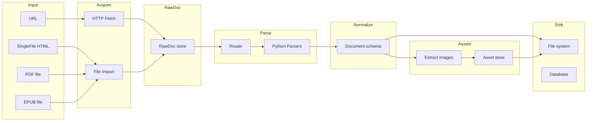
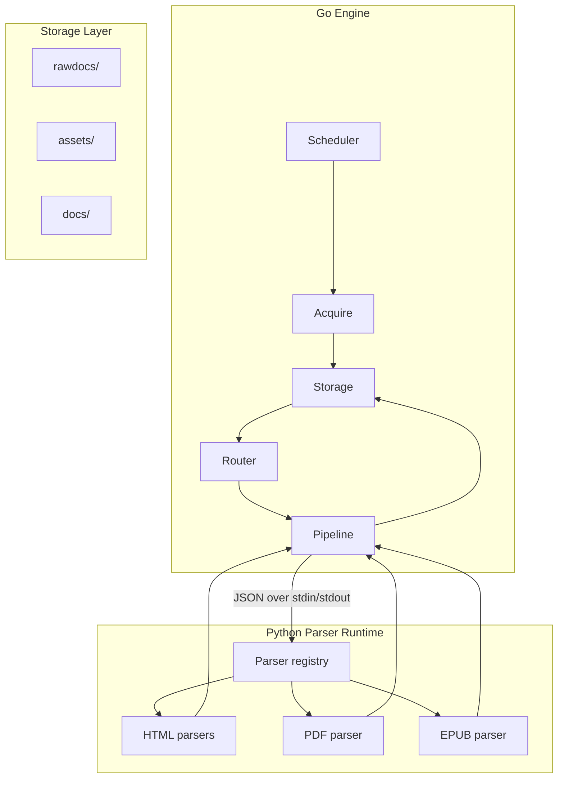

# Technical Specification: Knowledge Base Ingestion Engine

**Status:** Draft  
**Owners:** knowledge-core maintainers  
**Last Updated:** 2025-02  
**Version:** 0.1

---

## Table of Contents

- [1. Summary](#1-summary)
- [2. Background and context](#2-background-and-context)
  - [2.1. Problem statement](#21-problem-statement)
- [3. Goals and non-goals](#3-goals-and-non-goals)
  - [3.1. Goals](#31-goals)
  - [3.2. Non-goals](#32-non-goals)
- [4. Architectural options](#4-architectural-options)
  - [4.1. Option A: All-Python](#41-option-a-all-python)
  - [4.2. Option B: All-Go](#42-option-b-all-go)
  - [4.3. Option C: Go orchestrator + Python parsers](#43-option-c-go-orchestrator--python-parsers)
  - [4.4. Option D: Python orchestrator + Python worker pool](#44-option-d-python-orchestrator--python-worker-pool)
  - [4.5. Option E: Parsers as services](#45-option-e-parsers-as-services)
  - [4.6. Comparison and recommendation](#46-comparison-and-recommendation)
- [5. Recommended design: overview](#5-recommended-design-overview)
  - [5.1. Design principles](#51-design-principles)
  - [5.2. High-level pipeline](#52-high-level-pipeline)
  - [5.3. Component diagram](#53-component-diagram)
- [6. Pipeline stages](#6-pipeline-stages)
  - [5.1. Acquire](#51-acquire)
  - [5.2. RawDoc](#52-rawdoc)
  - [5.3. Parse](#53-parse)
  - [5.4. Normalize](#54-normalize)
  - [5.5. Assets](#55-assets)
  - [5.6. Sink](#56-sink)
- [6. Data models](#6-data-models)
  - [6.1. RawDoc schema](#61-rawdoc-schema)
  - [6.2. Document schema (normalized output)](#62-document-schema-normalized-output)
  - [6.3. Asset reference and storage](#63-asset-reference-and-storage)
- [7. Parser routing and adapters](#7-parser-routing-and-adapters)
  - [7.1. Router and rule format](#71-router-and-rule-format)
  - [7.2. HTML adapter (YAML) specification](#72-html-adapter-yaml-specification)
  - [7.3. Parser registry and dispatch](#73-parser-registry-and-dispatch)
- [8. Go–Python boundary](#8-gopython-boundary)
  - [8.1. Initial: stdin/stdout JSON](#81-initial-stdinstdout-json)
  - [8.2. Future: gRPC or HTTP parser service](#82-future-grpc-or-http-parser-service)
- [10. Storage layout](#10-storage-layout)
  - [10.1 Build and run (Makefile)](#101-build-and-run-makefile)
  - [10.2 Deployment (Docker)](#102-deployment-docker)
- [11. Error handling and replay](#11-error-handling-and-replay)
  - [11.1. Failure isolation](#111-failure-isolation)
  - [11.2. Replay and idempotency](#112-replay-and-idempotency)
- [12. Testing strategy](#12-testing-strategy)
- [13. Implementation phases](#13-implementation-phases)
- [14. Design choices within the recommendation](#14-design-choices-within-the-recommendation)
- [15. Open questions](#15-open-questions)
- [16. References](#16-references)

---

## 1. Summary

This document explores **feasible architectures** for a **Knowledge Base Ingestion Engine**: a system that acquires content from multiple sources (online/offline web, PDF, EPUB), parses it through pluggable parsers, normalizes it into a single document schema, extracts and stores assets (especially images), and sinks the result for downstream RAG/chunking/embedding. It compares several approaches (all-Python, all-Go, hybrid Go+Python, Python-with-workers, parsers-as-services), explains their trade-offs, and **recommends one** with a full design. The recommended design uses **Go for acquisition and orchestration** and **Python for parsing**, with clear contracts (JSON schemas, file layout) to support testing, replay, and evolution. Sections 5 onward detail that recommended design only.

---

## 2. Background and context

### 2.1. Problem statement

Knowledge bases and RAG systems need structured input: titles, sections, paragraphs, tables, code blocks, and figures, plus stable references to assets (images) that are stored once and referenced by documents. Inputs are heterogeneous:

- **Online web:** HTML fetched via HTTP, with site-specific DOM structure.
- **Offline web:** SingleFile-style HTML (possibly with inlined base64 images).
- **PDF:** Binary format with layout, embedded fonts and images.
- **EPUB:** Package of XHTML and assets.

Each source requires different parsing logic; the number of site- or source-specific parsers is expected to grow. The system must support registration, routing, testing, and failure isolation for these parsers, and must guarantee that images are persisted (local or object storage) and referenced in the normalized output.

---

## 3. Goals and non-goals

### 3.1. Goals

- **Unified output:** One normalized document schema (JSON and/or Markdown) for all sources, suitable for chunking, embedding, and vector storage.
- **Pluggable parsers:** Add new sources (sites, PDF, EPUB) via configuration and/or plugins without changing the engine core.
- **Asset discipline:** All images (and other binary assets) are stored in a dedicated area (directory or object storage) with stable identifiers; documents reference them by stable paths/IDs.
- **Replay and robustness:** Raw inputs are retained (RawDoc); parse failures are isolated and retriable; the engine remains stable when a parser fails.
- **Observability:** Traceability from output back to source (URL, file path, fetch time, parser version).

### 3.2. Non-goals

- **Real-time streaming ingestion:** The design targets batch or on-demand ingestion; streaming is out of scope for this spec.
- **Authentication and SSO:** Fetching authenticated pages or PDFs from enterprise systems is not specified here; the engine assumes inputs are either public or pre-fetched.
- **Chunking and embedding:** Chunking strategies and embedding models are consumers of the normalized output and are not part of this engine.
- **Vector DB implementation:** Sink may write to file system or a DB; specific vector DB (Milvus, Qdrant, pgvector) integration is left to downstream components.

---

## 4. Architectural options

From first principles, several ways to build the ingestion engine are feasible. Each has different trade-offs in language choice, operational complexity, parser ecosystem, and failure isolation.

### 4.1. Option A: All-Python

**Description:** A single Python process (or async event loop) does everything: HTTP fetch, file import, routing, parsing (HTML/PDF/EPUB), normalization, asset download, and sink. Parsers can be in-process modules or subprocesses.

**Pros:**

- One language and one runtime; simpler dependency and deployment (e.g. single venv or container).
- Full access to Python’s document-parsing ecosystem (Docling, ebooklib, lxml, BeautifulSoup) without process boundaries.
- Fast iteration: no cross-process protocol to define or debug.

**Cons:**

- Parser bugs or heavy PDF processing can block or crash the whole process unless you isolate parsers in subprocesses or worker processes.
- Concurrency is limited by GIL for CPU-bound parsing unless you use multiprocessing or out-of-process workers.
- You give up a single static binary and Go’s strength in concurrent I/O and scheduling.

**When to choose:** Small teams, mostly HTML and light PDF; you accept process restarts or use subprocess/worker isolation from the start.

---

### 4.2. Option B: All-Go

**Description:** The entire pipeline is implemented in Go: fetch, routing, HTML parsing (e.g. goquery), PDF/EPUB parsing via Go libraries or CGO bindings, normalize, assets, sink.

**Pros:**

- Single binary; strong concurrency and control over I/O and worker pools.
- No subprocess or RPC boundary; simpler ops (one process, one language).
- Good fit if you already have a Go-heavy stack.

**Cons:**

- Go’s PDF and EPUB story is weak compared to Python (e.g. Docling, ebooklib). You either reimplement a lot, shell out to external tools (e.g. pdftotext), or use CGO with C libs.
- HTML parsing and site-specific scraping are more mature in Python (lxml, selectors, adapter patterns). Doing everything in Go means more custom code per source type.
- Risk of the engine doing too much and becoming hard to maintain.

**When to choose:** You are committed to Go-only and can accept weaker or external PDF/EPUB support, or you only need HTML + one simple PDF path.

---

### 4.3. Option C: Go orchestrator + Python parsers

**Description:** Go owns acquisition (HTTP, file import), job scheduling, routing, RawDoc storage, and sink. Parsing runs in a separate Python process (or pool): Go sends a job (e.g. rawdoc_id, path, source_type) via stdin/stdout JSON or RPC; Python loads the content, runs the right parser, returns structured output. Go then runs normalize and assets and writes to sink.

**Pros:**

- **Failure isolation:** Parser crash or timeout does not kill the Go engine; you retry or mark the job failed and continue.
- **Best tool per layer:** Go for concurrency, retries, and deployment; Python for document parsing (Docling, ebooklib, lxml, YAML-driven HTML adapters).
- **Clear contract:** RawDoc and Document JSON (and optional parser request/response schema) give a testable boundary; you can replay from RawDoc or stub the Python side in tests.
- **Scaling path:** You can later replace stdin/stdout with gRPC or HTTP parser services and scale parsers independently.

**Cons:**

- Two runtimes to ship and maintain (Go binary + Python env or container).
- You must define and version the Go–Python protocol (payload format, timeouts, errors).
- Slightly more operational complexity (e.g. ensuring the right Python interpreter and deps are available where the engine runs).

**When to choose:** You need robust PDF/EPUB and flexible HTML parsing, multiple site adapters, and a stable engine that can run many jobs without parser failures bringing it down. **This is the option we recommend** (see 4.6).

---

### 4.4. Option D: Python orchestrator + Python worker pool

**Description:** Orchestration and scheduling live in Python (e.g. main process or Celery/Redis). Parsing runs in worker processes or threads (or separate containers): same language, but isolation via multiprocessing or task queues. Fetch can be in Python (e.g. httpx) or delegated to a small Go/CLI helper.

**Pros:**

- Single language (Python) for both orchestration and parsing; reuse of Docling, ebooklib, adapters.
- Worker pools (Celery, RQ, or multiprocessing) give parser isolation and some concurrency.
- No Go–Python protocol to design; easier for Python-only teams.

**Cons:**

- Orchestrator and workers are still in the same ecosystem; a bad dependency or global state can affect the scheduler. Process isolation depends on how you run workers.
- Scaling and deployment are often more involved (broker, workers, monitoring) than a single Go binary that spawns a Python subprocess.
- High-throughput I/O (many concurrent fetches) is not Go-level without careful async or multi-process setup.

**When to choose:** Team is Python-only and prefers task queues and workers over introducing Go; you are willing to operate Celery (or similar) and accept less “single binary” simplicity.

---

### 4.5. Option E: Parsers as services

**Description:** Acquisition and orchestration can be in Go or Python. Parsers are not in-process or subprocess; they are **services** exposed over HTTP or gRPC (or serverless functions). The engine sends a request (e.g. “parse this RawDoc”) to a parser service URL or queue; the service returns the parsed output. Parsers can be scaled and versioned independently (e.g. one container per parser type).

**Pros:**

- Maximum flexibility: add or change parsers without redeploying the engine; scale parser capacity separately; use different runtimes per parser (e.g. Python for PDF, Go for simple HTML).
- Clear API boundary; good for multi-team or multi-repo ownership of parsers.
- Can align with serverless (e.g. one Lambda per parse job) if that fits your infra.

**Cons:**

- Highest operational and design cost: service discovery, versioning, retries, timeouts, and possibly auth. Overkill for a single team or small number of parsers.
- Network latency and failure modes (e.g. parser service down) add complexity compared to local subprocess.
- Often justified only when you have many parser types, many consumers, or strict isolation requirements.

**When to choose:** Large or distributed teams; many parser services; need to scale or deploy parsers independently; already committed to a service mesh or serverless for other reasons.

---

### 4.6. Comparison and recommendation

| Criterion              | A: All-Python | B: All-Go | C: Go + Python | D: Python + workers | E: Parsers as services |
|------------------------|---------------|-----------|----------------|---------------------|-------------------------|
| Parser ecosystem       | Strong        | Weak      | Strong (Python)| Strong              | Flexible                |
| Failure isolation      | Weak*         | Strong    | Strong         | Medium              | Strong                  |
| Ops complexity         | Low           | Low       | Medium         | Medium–High         | High                    |
| Single binary / deploy | No            | Yes       | No             | No                  | No                      |
| Protocol / API design  | N/A           | N/A       | One boundary   | N/A                 | Per service             |
| Replay / testability   | Depends       | Good      | Good (RawDoc)  | Depends             | Good                    |

\*Unless you add subprocess or worker isolation in A or D.

**Recommendation: Option C (Go orchestrator + Python parsers).**

- Fits the goal of “many sources and site-specific parsers” without locking us into a weak PDF/HTML story (Go) or into a single-process risk (all-Python without isolation).
- One clear boundary (Go ↔ Python) and one protocol (e.g. stdin/stdout JSON then optionally gRPC/HTTP) keeps the design understandable and testable.
- RawDoc + Document contracts support replay and regression tests regardless of parser implementation.
- Operational cost stays bounded (one Go binary + one Python runtime/container) while leaving room to move to Option E later if parser count and scale justify it.

The rest of this document (sections 5–15) details **only Option C**: design principles, pipeline stages, data models, routing, Go–Python boundary, storage, error handling, testing, phases, and design choices within that option.

---

## 5. Recommended design: overview

The following subsections describe the **recommended design (Option C)** at a high level. Sections 6 onward fill in stages, schemas, and implementation notes.

### 5.1. Design principles

- **Acquisition in Go:** Concurrency, retries, rate limiting, and I/O are implemented in Go. Go drives the pipeline and manages RawDoc and job state.
- **Parsing in Python:** HTML cleaning, PDF (Docling), EPUB (ebooklib), and image extraction use Python. Parsers are invoked by the engine via a well-defined protocol (e.g. stdin/stdout JSON).
- **Contract-first:** Each stage consumes and produces defined structures (e.g. RawDoc JSON, Document JSON) so that stages can be tested and replaced independently.
- **Parse–acquire decoupling:** Parser crashes or timeouts do not bring down the engine; the engine retries or marks the job failed and continues.

### 5.2. High-level pipeline



Data flows as: **Input → Acquire → RawDoc → Parse → Normalize → Assets → Sink.** RawDoc is the first persistent artifact; parsing reads from RawDoc and produces a normalized Document; asset handling resolves and stores images and rewrites references; the final Document and assets are written to Sink.

### 5.3. Component diagram



---

## 6. Pipeline stages

### 6.1. Acquire

**Responsibility:** Turn an input (URL, local HTML/PDF/EPUB path) into a single **RawDoc** and persist it.

- **URL:** HTTP GET with configurable timeout, retries, and optional rate limiting; store response body (HTML) and metadata (final URL, status, fetch time).
- **SingleFile HTML:** Read from local path; optionally extract or preserve `saved_time` (or equivalent) from the file or filename; store as RawDoc with source type `singlefile_html`.
- **Local PDF/EPUB:** Read from path; store bytes or path reference and metadata; source type `pdf` or `epub`.

Output: a **RawDoc** record (see schema below) and, by default, the raw bytes or content written under `rawdocs/` with a stable ID so that Parse can re-read it for replay.

### 6.2. RawDoc

**Responsibility:** Canonical representation of “what we fetched or imported,” before any parsing.

- **Fields:** `rawdoc_id`, `source_type` (url | singlefile_html | pdf | epub), `source_uri` (URL or file path), `fetch_time`, `storage_path` (path under `rawdocs/` or object-store key), optional `content_preview` or `content_length`.
- **Storage:** Engine writes the raw content to `rawdocs/<rawdoc_id>.<ext>` (or equivalent) and records the path in RawDoc. This allows Parse to be re-run without re-fetching.

### 6.3. Parse

**Responsibility:** Select the right parser from source type (and optionally domain/path for HTML), invoke it with RawDoc, and receive a **parser output** that is still source-specific (e.g. HTML parser output with section list and image URLs).

- **Router:** Given RawDoc `source_type` and, for HTML, `source_uri`, select a parser (e.g. site-specific YAML adapter, or generic HTML, or PDF, or EPUB).
- **Invocation:** Engine passes RawDoc (or a minimal payload: rawdoc_id, storage_path, source_type, source_uri) to the Python runtime via the chosen protocol (e.g. JSON on stdin). Python loads the content from path or from payload, runs the parser, and prints a single JSON message to stdout (parser output).
- **Output:** Parser output is not yet the final Document schema; it may contain relative image URLs, site-specific fields, etc. Normalize (and Assets) will turn it into the canonical Document.

### 6.4. Normalize

**Responsibility:** Map parser output to the **Document** schema.

- **Sections:** Map parser blocks to `heading`, `paragraph`, `list`, `table`, `code`, `figure` (and any other agreed block types). Preserve order and hierarchy (e.g. heading levels).
- **Metadata:** Populate `meta` from parser meta and from RawDoc (source, fetch_time, parser_version).
- **Asset placeholders:** Replace image URLs or inlined data with **asset references** (e.g. `asset_id` or relative path to be filled by Assets stage). Normalizer does not download images; it only produces stable references (e.g. by position or by content hash key).

### 6.5. Assets

**Responsibility:** Resolve every asset reference (image URL, base64, or path), download or decode, store under a unified namespace, and rewrite Document references.

- **Input:** Document with asset placeholders (e.g. `{"type":"figure","asset_refs":[{"original_src":"https://...","caption":"..."}]}`).
- **Actions:** For each ref: resolve URL (or decode base64), optionally deduplicate by hash, write to `assets/<asset_id>.<ext>` (or object storage), assign stable `asset_id` or path.
- **Output:** Same Document with placeholders replaced by final `assets: [{"asset_id":"...", "path":"assets/...", "caption":"..."}]` (or equivalent). All image bytes live under `assets/` (or object store); Document only holds references.

### 6.6. Sink

**Responsibility:** Persist the final Document and ensure assets are visible where needed.

- **File system:** Write `docs/<doc_id>.json` (and optionally `docs/<doc_id>.md`). Assets are already under `assets/`.
- **Database:** Optional: insert document and asset metadata into a relational or document DB for indexing and retrieval.
- **Vector pipeline:** Out of scope for this spec; a separate process may read from `docs/` and `assets/` to chunk, embed, and push to a vector store.

---

## 7. Data models

### 7.1. RawDoc schema

RawDoc is the contract between Acquire and Parse. It is stored as JSON (e.g. `rawdocs/<rawdoc_id>.meta.json`) and references the raw content file.

```json
{
  "rawdoc_id": "uuid",
  "source_type": "url | singlefile_html | pdf | epub",
  "source_uri": "https://example.com/page | file:///path/to/file",
  "fetch_time": "ISO8601",
  "storage_path": "rawdocs/<rawdoc_id>.html",
  "content_type": "text/html | application/pdf | application/epub+zip",
  "content_length": 12345,
  "metadata": {}
}
```

- `storage_path`: Path (relative to repo or configurable root) where the raw bytes are stored. Parser reads from this path.

### 7.2. Document schema (normalized output)

The normalized Document is the contract for downstream chunking/embedding. The schema below defines the canonical structure.

```json
{
  "doc_id": "uuid",
  "meta": {
    "title": "string",
    "source": {
      "type": "html | pdf | epub",
      "path": "string",
      "url": "string | null",
      "rawdoc_id": "uuid"
    },
    "authors": ["string"],
    "published_at": "ISO8601 | null",
    "updated_at": "ISO8601 | null",
    "ingested_at": "ISO8601",
    "language": "string",
    "tags": ["string"],
    "parser_version": "string"
  },
  "sections": [
    {
      "section_id": "string",
      "type": "heading | paragraph | list | table | code | figure",
      "level": 1,
      "content": "string",
      "items": ["string"],
      "rows": [[]],
      "assets": [{"asset_id": "string", "path": "string", "caption": "string | null"}],
      "annotations": {"language": "string"}
    }
  ]
}
```

- **Sections:** Ordered list. `heading` has `level` (1–6); `list` has `items`; `table` has `rows` (and optionally header row); `code` has `content` and `annotations.language`; `figure` has `assets` with `path` (relative to asset root) and `caption`.
- **Images:** Always referenced via `assets` array with a stable `path` (and optional `asset_id`). No inline base64 in the final Document.

### 7.3. Asset reference and storage

- **Asset ID:** Optional content-addressed ID (e.g. SHA256 of first N bytes or full content) for deduplication. File name can be `<asset_id>.<ext>` or `<doc_id>_<index>.<ext>` depending on policy.
- **Path:** Relative path from a configured asset root (e.g. `assets/abc123.png`) so that documents remain portable.
- **Metadata:** Optional small JSON per asset (dimensions, mime type) stored alongside or in a manifest; not required for minimal RAG use.

---

## 8. Parser routing and adapters

### 8.1. Router and rule format

Routing decides which parser handles a RawDoc.

- **By source_type:** `pdf` → PDF parser, `epub` → EPUB parser, `url` or `singlefile_html` → HTML parser.
- **For HTML:** Use a **routes** configuration (e.g. YAML) that maps (domain, path pattern) to an **adapter** (a YAML file per site or path). Order of rules matters: first match wins. A default rule can point to a generic HTML parser.

Example `configs/routes.yaml`:

```yaml
routes:
  - domain: "example.com"
    path_prefix: "/docs/"
    adapter: "parsers/html/adapters/example_docs.yaml"
  - domain: "*"
    adapter: "parsers/html/adapters/generic.yaml"
```

### 8.2. HTML adapter (YAML) specification

Adapters (one YAML file per site or content type) define:

- **Meta selectors:** How to extract title, URL, published_at, updated_at, fetch_time (including special token `saved_time` for SingleFile).
- **Content root:** CSS selector for the main content container.
- **Block list:** Sequence of block types (heading, paragraph, table, figure, link, code) with CSS selectors and optional attribute mappings (e.g. `src`, `alt` for images).
- **Ignore selectors:** Elements to strip (scripts, styles, ads).

The parser runtime (Python) loads the adapter YAML, fetches HTML from the path indicated by the engine, applies selectors (e.g. via lxml/BeautifulSoup or PyQuery), and returns a **parser output** (list of blocks + meta). Normalize then maps this to the Document schema and asset refs.

### 8.3. Parser registry and dispatch

- **Python side:** A single process (or pool of workers) loads all parser modules (HTML adapter loader, PDF parser e.g. Docling, EPUB parser e.g. ebooklib). The engine sends one request per RawDoc; the runtime selects parser by route and returns one response.
- **Versioning:** Parser response can include `parser_version` so that Document carries it in `meta.parser_version` for reproducibility and debugging.

---

## 9. Go–Python boundary

### 9.1. Initial: stdin/stdout JSON

- **Request:** Engine writes a single JSON line to the parser process stdin: e.g. `{"rawdoc_id":"...", "storage_path":"...", "source_type":"...", "source_uri":"..."}`. Parser reads from `storage_path` (or engine can pass content in payload for small bodies).
- **Response:** Parser writes a single JSON object to stdout (one line or pretty-printed), then exits (or stays alive for next request if using a long-lived worker). Response includes parser output (sections + meta) and optional `parser_version` or `error`.
- **Timeouts:** Engine sets a subprocess timeout (e.g. 60s); on timeout or non-zero exit, engine marks the job as failed and can retry or skip.

### 9.2. Future: gRPC or HTTP parser service

- **gRPC:** Define a `Parse(RawDoc) -> ParserOutput` RPC; Python runs as a server, Go calls it. Allows connection pooling and streaming if needed.
- **HTTP:** POST a JSON body with RawDoc (or path); response is ParserOutput JSON. Simpler than gRPC and easier to debug; can add auth and load balancing later.

---

## 10. Storage layout

Recommended directory layout (aligns with README and supports replay). Runtime data lives under `data/` so the repository root stays code-only and `data/` can be gitignored. When deploying with Docker, `data/` is provided by a shared volume so acquire and ingest services communicate via the same directory.

```
repo/
├── cmd/                       # Go executables (e.g. acquire)
├── fetch/                     # Go: acquisition logic (RawDoc, URL/file fetch)
├── ingest/                    # Python: parse, normalize, assets, sink
│   ├── html/
│   │   └── adapters/
│   └── ...
├── configs/
│   └── routes.yaml
├── schemas/
│   ├── rawdoc.json
│   └── document.json
├── data/                      # Runtime data (gitignored)
│   ├── rawdocs/               # Raw content (by rawdoc_id)
│   ├── assets/                # Extracted images and binaries
│   └── docs/                  # Normalized documents (doc_id.json / doc_id.md)
├── Dockerfile.acquire
├── Dockerfile.ingest
└── docker-compose.yml
```

- **data/rawdocs/:** One file per RawDoc (e.g. `<rawdoc_id>.html`). RawDoc meta can be in the same directory or in a small index DB.
- **data/assets/:** Flat or hashed subdirs; filenames by asset_id or doc_id + index. No inline base64 in output docs.
- **data/docs/:** One JSON (and optionally one Markdown) per doc_id for downstream consumption.

### 10.1 Build and run (Makefile)

The project entry point is the **Makefile**. Supported targets:

- **build:** Compile Go `bin/acquire`. **build-py:** Install Python dependencies.
- **fetch:** Acquire only — `make fetch URL=https://...` or `make fetch FILE=path/to/file.html`. Writes only to `data/rawdocs/`.
- **ingest:** Ingest only — `make ingest` (all unprocessed RawDocs) or `make ingest RAWDOC_ID=id`. Reads `data/rawdocs/`, writes `data/docs/` and `data/assets/`.
- **run:** Full pipeline for one URL or file — `make run URL=https://...` (fetch then ingest).
- **docker-build / docker-up:** Build and start the two services. **clean:** Remove `bin/` and caches.

### 10.2 Deployment (Docker)

Deployment uses **docker-compose** with two services and a **shared volume** for `data/`:

- **acquire:** Go binary. Writes `data/rawdocs/`. Invoked on demand (e.g. `docker compose run acquire -url https://...`).
- **ingest:** Python service running the **poller**: periodically scans `data/rawdocs/*.meta.json`, skips already-processed RawDocs (`.done` marker), and runs parse → normalize → assets → sink for each new one. Writes `data/docs/` and `data/assets/`.

No network RPC between services; communication is via the shared `data/` volume.

---

## 11. Error handling and replay

### 11.1. Failure isolation

- **Acquire failure:** Network or file read errors; retry with backoff (configurable); after N failures, mark job failed and optionally alert. Do not block other jobs.
- **Parse failure:** Parser timeout, crash, or malformed output. Engine catches, logs RawDoc id and error, marks job as parse_failed. Optionally push to a retry queue or dead-letter store. Engine process continues.
- **Asset failure:** Single image download failure can be recorded in Document (e.g. broken ref) or skipped; document is still emitted so that partial success is possible.

### 11.2. Replay and idempotency

- **Re-run from RawDoc:** Because RawDoc and raw content are stored, re-running Parse for the same rawdoc_id should be idempotent (same doc_id or deterministic doc_id from rawdoc_id). No need to re-fetch.
- **Idempotent writes:** Sink writes docs and assets with stable IDs so that re-running the pipeline for the same input does not duplicate data; overwrite or skip-if-exists policy is configurable.

---

## 12. Testing strategy

- **Unit tests (Go):** Acquire (mock HTTP, local files), Router (match rules), Pipeline (mock parser stdin/stdout).
- **Unit tests (Python):** Each adapter (HTML) with fixture HTML; PDF/EPUB with fixture files; output checked against a golden Document snippet or schema.
- **Integration:** End-to-end test: one URL and one local PDF → RawDoc → Parse → Normalize → Assets → Sink; assert Document and asset files exist and Document references are valid.
- **Replay tests:** Store a set of RawDocs in CI; run parser only and assert output matches expected or schema. Ensures parser changes do not regress.

---

## 13. Implementation phases

**Phase 1 – Foundation**  
- Formalize RawDoc and Document JSON schemas in `schemas/`.  
- Implement Go Acquire (URL + file import) and RawDoc write.  
- Implement Python HTML parser with stdin/stdout JSON interface; support one site adapter to start.  
- Implement Normalize (parser output → Document) and Assets (download images, rewrite refs).  
- Sink: write `docs/<doc_id>.json` and `assets/`.

**Phase 2 – Routing and multiple parsers**  
- Introduce `configs/routes.yaml` and Router in Go.  
- Python runtime: load adapter by route, support multiple adapters.  
- Add PDF parser (Docling) and EPUB parser (ebooklib); route by source_type.  
- Replay: re-run from RawDoc for any source type.

**Phase 3 – Production hardening**  
- Retries, timeouts, and failure isolation.  
- Optional DB sink and job queue.  
- Observability: logging, metrics (counts, latencies), optional tracing.

**Phase 4 – Scale and flexibility (optional)**  
- gRPC or HTTP parser service; parser worker pool.  
- Object storage for rawdocs and assets.  
- Pluggable sink (e.g. event to vector pipeline).

---

## 14. Design choices within the recommendation

Within Option C, several design choices were made. Alternatives and their trade-offs:

- **RawDoc vs stream-through:** Persisting raw content (RawDoc) before parsing adds storage but enables replay and regression tests without re-fetching. Stream-through (parse directly from fetched bytes) reduces storage and latency but gives no replay and ties debugging to live fetches. **Choice:** RawDoc for robustness and testability; stream-through can be an optional fast path later (e.g. for trusted local files).

- **YAML adapters vs code-only parsers:** Site-specific HTML can be driven by YAML (selectors, block types) so non-developers can add or tune rules, or implemented entirely in code (one module per site). **Choice:** YAML adapters for HTML where structure is selector-friendly; code-only for complex or stateful parsing (e.g. some PDF flows). Hybrid is supported: router picks adapter or code parser by route.

- **Normalize in Go vs Python:** Normalize (parser output → Document schema) can live in Go (after receiving parser JSON) or in Python (parser returns already-normalized Document). **Choice:** Normalize in Go so the Document schema is enforced in one place and parser output remains "raw" (easier to change parser without changing schema). Alternatively, Python can return Document-shaped JSON and Go only validates and handles assets; both are valid.

- **Asset deduplication: per-doc vs global:** Images can be deduplicated only within a document (simpler, no cross-doc references) or globally by content hash (saves space, complicates deletion and naming). **Choice:** Start with per-doc or doc-scoped paths; introduce global dedup later if storage becomes a concern.

- **Inline images in Document:** Go’s Storing base64 in JSON is heavy and not ideal for chunking/embedding. **Choice:** External asset store with references only; documents stay small and assets can be deduplicated or served via CDN later.

---

## 15. Open questions

- **Docling vs other PDF libs:** Docling is the current candidate; need to confirm license and long-term maintenance; consider pypdf + layout extraction as fallback.
- **EPUB table/code extraction:** How to represent complex EPUB content (nested sections, media overlays) in the flat section list; may need a small extension (e.g. `type: "epub_section"` with nested children).
- **Asset deduplication scope:** Per-doc vs global (by hash); global reduces storage but complicates deletion and namespace.
- **Auth for protected PDFs/URLs:** Out of scope for v1; later could pass tokens or cookies via RawDoc metadata or secure config.

---

## 16. References

- Project README: `README.md` (requirements and pipeline sketch).  
- Docling: [docling documentation](https://github.com/DS4SD/docling) for PDF parsing.  
- SingleFile: [SingleFile](https://github.com/gildas-lormeau/SingleFile) for HTML capture.  
- Google design docs: [Design Doc Template](https://www.industrialempathy.com/posts/design-doc-template/) and similar for structure and TOC conventions.
