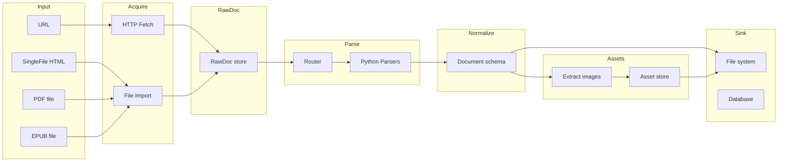
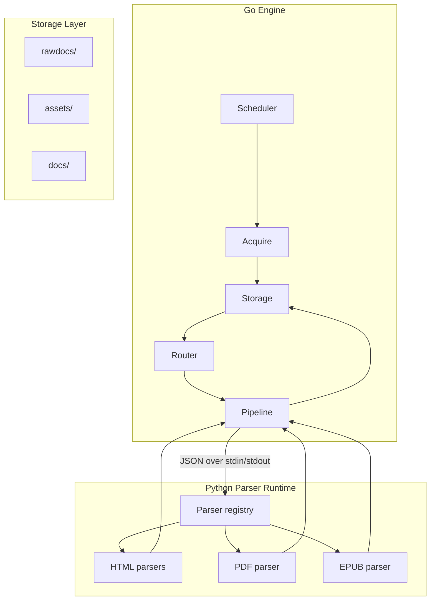

# 技术方案：知识库摄取引擎

**状态：** 草案  
**负责人：** knowledge-core 维护者  
**最后更新：** 2025-02  
**版本：** 0.1

---

## 目录

- [1. 摘要](#1-摘要)
- [2. 背景与上下文](#2-背景与上下文)
  - [2.1. 问题陈述](#21-问题陈述)
- [3. 目标与非目标](#3-目标与非目标)
  - [3.1. 目标](#31-目标)
  - [3.2. 非目标](#32-非目标)
- [4. 可行方案与对比](#4-可行方案与对比)
  - [4.1. 方案 A：全 Python](#41-方案-a全-python)
  - [4.2. 方案 B：全 Go](#42-方案-b全-go)
  - [4.3. 方案 C：Go 编排 + Python 解析](#43-方案-cgo-编排--python-解析)
  - [4.4. 方案 D：Python 编排 + 工作进程池](#44-方案-dpython-编排--工作进程池)
  - [4.5. 方案 E：解析器即服务](#45-方案-e解析器即服务)
  - [4.6. 对比与推荐](#46-对比与推荐)
- [5. 推荐设计概览](#5-推荐设计概览)
  - [5.1. 设计原则](#51-设计原则)
  - [5.2. 高层流水线](#52-高层流水线)
  - [5.3. 组件图](#53-组件图)
- [6. 流水线阶段](#6-流水线阶段)
  - [6.1. Acquire（获取）](#61-acquire获取)
  - [6.2. RawDoc（原始文档）](#62-rawdoc原始文档)
  - [6.3. Parse（解析）](#63-parse解析)
  - [6.4. Normalize（统一结构）](#64-normalize统一结构)
  - [6.5. Assets（资源）](#65-assets资源)
  - [6.6. Sink（落库）](#66-sink落库)
- [7. 数据模型](#7-数据模型)
  - [7.1. RawDoc 模式](#71-rawdoc-模式)
  - [7.2. Document 模式（规范化输出）](#72-document-模式规范化输出)
  - [7.3. 资源引用与存储](#73-资源引用与存储)
- [8. 解析器路由与适配器](#8-解析器路由与适配器)
  - [8.1. 路由与规则格式](#81-路由与规则格式)
  - [8.2. HTML 适配器（YAML）规范](#82-html-适配器yaml规范)
  - [8.3. 解析器注册与分发](#83-解析器注册与分发)
- [9. Go–Python 边界](#9-gopython-边界)
  - [9.1. 初期：stdin/stdout JSON](#91-初期stdinstdout-json)
  - [9.2. 后续：gRPC 或 HTTP 解析服务](#92-后续grpc-或-http-解析服务)
- [10. 存储布局](#10-存储布局)
  - [10.1 构建与运行（Makefile）](#101-构建与运行makefile)
  - [10.2 部署（Docker）](#102-部署docker)
- [11. 错误处理与回放](#11-错误处理与回放)
  - [11.1. 失败隔离](#111-失败隔离)
  - [11.2. 回放与幂等](#112-回放与幂等)
- [12. 测试策略](#12-测试策略)
- [13. 实施阶段](#13-实施阶段)
- [14. 推荐设计内的设计选择](#14-推荐设计内的设计选择)
- [15. 待决问题](#15-待决问题)
- [16. 参考资料](#16-参考资料)

---

## 1. 摘要

本文档**从零探索**知识库摄取引擎的**多种可行架构**：从多种来源（在线/离线网页、PDF、EPUB）获取内容，经可插拔解析器解析、规范化为统一文档模式，抽取并落盘资源（尤其是图片），并输出供下游 RAG/分块/向量化使用。文档**对比多种方案**（全 Python、全 Go、Go 编排 + Python 解析、Python + 工作进程池、解析器即服务），说明各自优劣与适用场景，并**推荐一种**（Go 编排 + Python 解析）并给出完整设计。推荐方案将获取与编排放在 Go、解析放在 Python，阶段间以明确契约（JSON 模式、目录布局）支持测试、回放与演进。第 5 节起仅展开该推荐方案。

---

## 2. 背景与上下文

### 2.1. 问题陈述

知识库与 RAG 需要结构化输入：标题、章节、段落、表格、代码块与图表，以及指向资源的稳定引用（图片需落盘且可追溯）。输入形态多样：

- **在线网页：** 通过 HTTP 抓取的 HTML，站点 DOM 各异。
- **离线网页：** SingleFile 等保存的 HTML（可能含内联 base64 图片）。
- **PDF：** 二进制格式，含版式、字体与内嵌图片。
- **EPUB：** 由 XHTML 与资源组成的包。

不同来源需要不同解析逻辑；站点/来源级解析器会持续增加。系统需支持解析器的注册、路由、测试与失败隔离，并保证图片持久化（本地或对象存储）且在规范化输出中可引用。

---

## 3. 目标与非目标

### 3.1. 目标

- **统一输出：** 所有来源产出同一规范化文档模式（JSON 和/或 Markdown），便于分块、向量化与向量库。
- **可插拔解析器：** 通过配置和/或插件新增来源（站点、PDF、EPUB），无需改引擎核心。
- **资源规范：** 所有图片（及其他二进制资源）存入统一区域（目录或对象存储），使用稳定标识；文档通过稳定路径/ID 引用。
- **回放与稳健性：** 保留原始输入（RawDoc）；解析失败可隔离与重试；解析异常不拖垮引擎。
- **可观测性：** 从输出可追溯来源（URL、路径、抓取时间、解析器版本）。

### 3.2. 非目标

- **实时流式摄取：** 本设计面向批处理或按需摄取，不涵盖流式。
- **认证与 SSO：** 对需登录的页面或 PDF 的抓取不在此规范内；引擎假设输入为公开或已预先抓取。
- **分块与向量化：** 分块策略与向量模型由下游消费规范化输出，不属于本引擎。
- **向量库实现：** Sink 可写文件系统或数据库；与具体向量库（Milvus、Qdrant、pgvector）的集成由下游负责。

---

## 4. 可行方案与对比

从第一性原理出发，有多种构建摄取引擎的方式，在语言选型、运维复杂度、解析生态与失败隔离上各有取舍。

### 4.1. 方案 A：全 Python

**描述：** 单一 Python 进程（或异步事件循环）完成全部工作：HTTP 抓取、文件导入、路由、解析（HTML/PDF/EPUB）、规范化、资源下载与落库。解析器可为进程内模块或子进程。

**优点：** 单一语言与运行时，依赖与部署简单（如单一 venv 或容器）；可充分利用 Python 文档解析生态（Docling、ebooklib、lxml、BeautifulSoup），无进程边界；迭代快，无需定义或调试跨进程协议。

**缺点：** 解析器错误或重型 PDF 处理可能阻塞或拖垮整个进程，除非在一开始就用子进程或工作进程做隔离；受 GIL 限制，CPU 密集解析的并发需依赖多进程或进程外 worker；无法享受单二进制与 Go 在并发 I/O、调度上的优势。

**适用：** 小团队、以 HTML 与轻量 PDF 为主；可接受进程重启或从一开始就用子进程/worker 隔离。

---

### 4.2. 方案 B：全 Go

**描述：** 整条流水线用 Go 实现：抓取、路由、HTML 解析（如 goquery）、通过 Go 库或 CGO 做 PDF/EPUB 解析、规范化、资源、落库。

**优点：** 单二进制；并发与 I/O 控制力强；无子进程或 RPC 边界，运维简单（单进程、单语言）；若已有 Go 技术栈则一致性好。

**缺点：** Go 的 PDF/EPUB 生态远弱于 Python（如 Docling、ebooklib），要么自研很多、要么外调工具（如 pdftotext）或 CGO 绑 C 库；HTML 与站点级抓取在 Python 中更成熟（lxml、选择器、适配器模式），全用 Go 则每种来源都要写更多定制逻辑；引擎容易承担过多职责，维护成本上升。

**适用：** 坚持仅用 Go，且能接受较弱或外部的 PDF/EPUB 能力，或仅需 HTML + 一种简单 PDF 路径。

---

### 4.3. 方案 C：Go 编排 + Python 解析

**描述：** Go 负责获取（HTTP、文件导入）、任务调度、路由、RawDoc 存储与落库。解析在独立 Python 进程（或进程池）中运行：Go 通过 stdin/stdout JSON 或 RPC 下发任务（如 rawdoc_id、路径、source_type）；Python 加载内容、执行对应解析器、返回结构化结果；Go 再执行规范化与资源处理并写入落库。

**优点：** **失败隔离**：解析崩溃或超时不会拖垮 Go 引擎，可重试或标记失败后继续。**各层用最合适工具**：Go 做并发、重试与部署，Python 做文档解析（Docling、ebooklib、lxml、YAML 驱动的 HTML 适配器）。**契约清晰**：RawDoc 与 Document JSON（及可选的解析请求/响应模式）形成可测试边界，可基于 RawDoc 回放或对 Python 侧做桩。**扩展路径**：后续可将 stdin/stdout 换成 gRPC 或 HTTP 解析服务，独立扩展解析能力。

**缺点：** 需同时维护两种运行时（Go 二进制 + Python 环境或容器）；必须定义并版本化 Go–Python 协议（载荷格式、超时、错误）；运维略复杂（如保证运行引擎的环境中有正确 Python 与依赖）。

**适用：** 需要可靠 PDF/EPUB 与灵活 HTML 解析、多站点适配器，且希望引擎在大量任务下不因解析失败而宕机。**本方案推荐此选项**（见 4.6）。

---

### 4.4. 方案 D：Python 编排 + 工作进程池

**描述：** 编排与调度在 Python 中（主进程或 Celery/Redis）；解析在 worker 进程或线程（或独立容器）中运行，同语言但通过多进程或任务队列隔离。抓取可用 Python（如 httpx）或委托给小型 Go/CLI 工具。

**优点：** 编排与解析均为 Python，单一语言；可复用 Docling、ebooklib、适配器；worker 池（Celery、RQ 或多进程）提供解析隔离与一定并发。

**缺点：** 编排与 worker 仍在同一生态，错误依赖或全局状态可能影响调度器；扩展与部署常比“单 Go 二进制 + 调 Python 子进程”更复杂（broker、worker、监控）；高并发 I/O（大量并发抓取）在非 Go 下需精心设计异步或多进程。

**适用：** 团队纯 Python、倾向任务队列与 worker 而非引入 Go；愿意运维 Celery 等并接受较少的“单二进制”简洁性。

---

### 4.5. 方案 E：解析器即服务

**描述：** 获取与编排可在 Go 或 Python；解析器不以进程内或子进程形式存在，而是通过 HTTP 或 gRPC（或 serverless 函数）暴露的**服务**。引擎向解析服务 URL 或队列发送请求（如“解析该 RawDoc”），服务返回解析结果。解析器可独立扩缩与版本（如每类解析器一个容器）。

**优点：** 灵活性最高：增改解析器无需重发引擎；可独立扩展解析容量；不同解析器可用不同运行时（如 PDF 用 Python、简单 HTML 用 Go）。边界清晰，适合多团队或多仓库拥有解析器；可与 serverless（如按任务调 Lambda）对齐。

**缺点：** 设计与运维成本最高：服务发现、版本、重试、超时乃至鉴权；解析服务不可用或网络延迟增加故障面；通常仅在解析类型多、消费方多或隔离要求高时才值得。

**适用：** 大型或分布式团队、多种解析服务、需独立扩缩或部署解析器，或已有服务网格/serverless 等基础设施。

---

### 4.6. 对比与推荐

| 维度           | A：全 Python | B：全 Go | C：Go+Python | D：Python+workers | E：解析器即服务 |
|----------------|--------------|----------|--------------|-------------------|------------------|
| 解析生态       | 强           | 弱       | 强（Python） | 强                | 灵活             |
| 失败隔离       | 弱*          | 强       | 强           | 中                | 强               |
| 运维复杂度     | 低           | 低       | 中           | 中–高             | 高               |
| 单二进制/部署   | 否           | 是       | 否           | 否                | 否               |
| 协议/API 设计  | 无           | 无       | 单一边界     | 无                | 按服务           |
| 回放/可测性    | 视实现而定   | 好       | 好（RawDoc） | 视实现而定        | 好               |

\*除非在 A 或 D 中显式用子进程或 worker 做隔离。

**推荐：方案 C（Go 编排 + Python 解析）。**

- 满足“多来源、多站点解析器”的目标，又不必接受弱 PDF/HTML 能力（全 Go）或单进程风险（全 Python 且无隔离）。
- 单一边界（Go ↔ Python）与单一协议（如先 stdin/stdout JSON，再可选 gRPC/HTTP）使设计易理解、可测试。
- RawDoc + Document 契约支持回放与回归测试，与解析实现解耦。
- 运维成本可控（一个 Go 二进制 + 一个 Python 运行时/容器），并为将来若解析数量与规模扩大时迁向方案 E 留有余地。

下文第 5–16 节仅展开**方案 C**：设计原则、流水线阶段、数据模型、路由、Go–Python 边界、存储、错误处理、测试、阶段划分及推荐设计内的设计选择。

---

## 5. 推荐设计概览

以下为**推荐设计（方案 C）**的高层描述；第 6 节起补充阶段、模式与实现要点。

### 5.1. 设计原则

- **Go 负责获取：** 并发、重试、限流与 I/O 在 Go 中实现；由 Go 驱动流水线并管理 RawDoc 与任务状态。
- **Python 负责解析：** HTML 清洗、PDF（Docling）、EPUB（ebooklib）及图片抽取使用 Python；通过明确协议（如 stdin/stdout JSON）由引擎调用。
- **契约优先：** 各阶段输入输出有明确定义（如 RawDoc JSON、Document JSON），便于独立测试与替换。
- **解析与获取解耦：** 解析超时或崩溃不影响引擎；引擎可重试或标记失败后继续其他任务。

### 5.2. 高层流水线



数据流：**Input → Acquire → RawDoc → Parse → Normalize → Assets → Sink**。RawDoc 为首次持久化产物；解析读取 RawDoc 产出规范化 Document；资源阶段解析并存储图片、重写引用；最终 Document 与资源写入 Sink。

### 5.3. 组件图



---

## 6. 流水线阶段

### 6.1. Acquire（获取）

**职责：** 将输入（URL、本地 HTML/PDF/EPUB 路径）转为 **RawDoc** 并持久化。

- **URL：** HTTP GET，可配置超时、重试与限流；保存响应体（HTML）及元数据（最终 URL、状态、抓取时间）。
- **SingleFile HTML：** 从本地路径读取；可选从文件或文件名解析 `saved_time`；以来源类型 `singlefile_html` 存为 RawDoc。
- **本地 PDF/EPUB：** 从路径读取；保存字节或路径引用及元数据；来源类型 `pdf` 或 `epub`。

输出：**RawDoc** 记录（见下文模式）及默认将原始内容写入 `rawdocs/` 下稳定 ID，供 Parse 回放时再次读取。

### 6.2. RawDoc（原始文档）

**职责：** “我们抓取或导入的内容”的规范表示，不做任何解析。

- **字段：** `rawdoc_id`、`source_type`（url | singlefile_html | pdf | epub）、`source_uri`、`fetch_time`、`storage_path`（rawdocs/ 下路径或对象存储 key）、可选 `content_preview`/`content_length`。
- **存储：** 引擎将原始内容写入 `rawdocs/<rawdoc_id>.<ext>` 并在 RawDoc 中记录路径，以便在不重新抓取的情况下重放 Parse。

### 6.3. Parse（解析）

**职责：** 按来源类型（及 HTML 的域名/路径）选择解析器，传入 RawDoc，并接收仍为来源相关的 **解析输出**（如 HTML 解析器的章节列表与图片 URL）。

- **路由：** 根据 RawDoc 的 `source_type` 及 HTML 的 `source_uri` 选择解析器（站点 YAML 适配器、通用 HTML、PDF、EPUB）。
- **调用：** 引擎通过约定协议（如 stdin JSON）将 RawDoc（或最小载荷：rawdoc_id、storage_path、source_type、source_uri）传给 Python 运行时；Python 从路径或载荷读取内容、执行解析、向 stdout 输出一条 JSON（解析结果）。
- **输出：** 解析输出尚非最终 Document 模式，可含相对图片 URL、站点特有字段等；Normalize（及 Assets）将其转为规范 Document。

### 6.4. Normalize（统一结构）

**职责：** 将解析输出映射为 **Document** 模式。

- **章节：** 将解析块映射为 `heading`、`paragraph`、`list`、`table`、`code`、`figure` 等；保持顺序与层级。
- **元数据：** 从解析 meta 与 RawDoc 填充 `meta`（来源、fetch_time、parser_version）。
- **资源占位：** 将图片 URL 或内联数据替换为 **资源引用**（如 asset_id 或待 Assets 阶段填充的相对路径）；本阶段不下载图片，仅生成稳定引用。

### 6.5. Assets（资源）

**职责：** 解析每个资源引用（图片 URL、base64 或路径），下载或解码，在统一命名空间下存储，并重写 Document 中的引用。

- **输入：** 带资源占位的 Document。
- **动作：** 对每个引用解析 URL（或解码 base64），可选按 hash 去重，写入 `assets/<asset_id>.<ext>`（或对象存储），分配稳定 `asset_id` 或路径。
- **输出：** 同一 Document，占位替换为最终 `assets: [{"asset_id":"...", "path":"assets/...", "caption":"..."}]`；所有图片字节位于 `assets/`（或对象存储），Document 仅保留引用。

### 6.6. Sink（落库）

**职责：** 持久化最终 Document，并确保资源可被访问。

- **文件系统：** 写入 `docs/<doc_id>.json`（可选 `docs/<doc_id>.md`）；资源已在 `assets/`。
- **数据库：** 可选将文档与资源元数据写入关系型或文档库。
- **向量流水线：** 本规范不涵盖；可由独立进程读取 `docs/` 与 `assets/` 做分块、向量化并写入向量库。

---

## 7. 数据模型

### 7.1. RawDoc 模式

RawDoc 是 Acquire 与 Parse 之间的契约，以 JSON 存储（如 `rawdocs/<rawdoc_id>.meta.json`），并引用原始内容文件。

```json
{
  "rawdoc_id": "uuid",
  "source_type": "url | singlefile_html | pdf | epub",
  "source_uri": "https://example.com/page | file:///path/to/file",
  "fetch_time": "ISO8601",
  "storage_path": "rawdocs/<rawdoc_id>.html",
  "content_type": "text/html | application/pdf | application/epub+zip",
  "content_length": 12345,
  "metadata": {}
}
```

### 7.2. Document 模式（规范化输出）

下文模式定义规范化的文档结构。

```json
{
  "doc_id": "uuid",
  "meta": {
    "title": "string",
    "source": { "type": "html | pdf | epub", "path": "string", "url": "string | null", "rawdoc_id": "uuid" },
    "authors": ["string"],
    "published_at": "ISO8601 | null",
    "updated_at": "ISO8601 | null",
    "ingested_at": "ISO8601",
    "language": "string",
    "tags": ["string"],
    "parser_version": "string"
  },
  "sections": [
    {
      "section_id": "string",
      "type": "heading | paragraph | list | table | code | figure",
      "level": 1,
      "content": "string",
      "items": ["string"],
      "rows": [[]],
      "assets": [{"asset_id": "string", "path": "string", "caption": "string | null"}],
      "annotations": {"language": "string"}
    }
  ]
}
```

- **sections：** 有序；`figure` 通过 `assets` 数组引用资源路径，最终输出不含内联 base64。

### 7.3. 资源引用与存储

- **asset_id：** 可选内容寻址 ID（如 SHA256），用于去重；文件名可为 `<asset_id>.<ext>` 或按策略 `<doc_id>_<index>.<ext>`。
- **path：** 相对配置资源根的路径（如 `assets/abc123.png`），保证文档可迁移。
- **元数据：** 可选的每资源小 JSON（尺寸、MIME）可单独存储或写入清单。

---

## 8. 解析器路由与适配器

### 8.1. 路由与规则格式

- **按 source_type：** pdf → PDF 解析器，epub → EPUB 解析器，url/singlefile_html → HTML 解析器。
- **HTML：** 使用 `configs/routes.yaml` 等配置，将（域名、路径模式）映射到适配器（按站点或路径的 YAML 文件）；先匹配优先；可设默认通用 HTML 解析器。

示例：在 `configs/routes.yaml` 中配置 domain、path_prefix 与 adapter 路径即可。

### 8.2. HTML 适配器（YAML）规范

适配器 YAML 约定：meta 选择器、内容根、块列表（heading/paragraph/table/figure/link/code）、忽略选择器。解析运行时加载 YAML，对 HTML 应用选择器，返回解析输出；Normalize 再映射为 Document 与资源引用。

### 8.3. 解析器注册与分发

- **Python 侧：** 单进程（或 worker 池）加载所有解析模块；引擎按路由选择解析器，一次请求一条 RawDoc，返回一条响应；响应可带 `parser_version` 写入 Document meta。

---

## 9. Go–Python 边界

### 9.1. 初期：stdin/stdout JSON

- **请求：** 引擎向解析进程 stdin 写入单行 JSON（rawdoc_id、storage_path、source_type、source_uri 等）；解析器从 storage_path 读取内容。
- **响应：** 解析器向 stdout 写入单条 JSON（解析输出 + 可选 parser_version/error）；可单次退出或长驻处理下一条。
- **超时：** 引擎设置子进程超时（如 60s）；超时或非零退出则标记任务失败并可选重试或跳过。

### 9.2. 后续：gRPC 或 HTTP 解析服务

- **gRPC：** 定义 `Parse(RawDoc) -> ParserOutput`；Python 作为服务端，Go 调用；便于连接池与扩展。
- **HTTP：** POST JSON 体传递 RawDoc 或路径，响应为 ParserOutput JSON；实现简单，便于调试与负载均衡。

---

## 10. 存储布局

与 README 一致、支持回放的推荐目录结构。运行时数据统一放在 `data/` 下，仓库根目录仅保留代码与配置，`data/` 可整体加入 .gitignore。Docker 部署时由共享 volume 提供 `data/`，acquire 与 ingest 通过该目录解耦通讯。

```
repo/
├── cmd/                        # Go 可执行入口
├── fetch/                      # Go：抓取逻辑（RawDoc、URL/文件拉取）
├── ingest/                     # Python：解析、规范化、资源、落盘
│   ├── html/adapters/
│   └── ...
├── configs/
│   └── routes.yaml
├── schemas/
│   ├── rawdoc.json
│   └── document.json
├── data/                       # 运行时数据（gitignore）
│   ├── rawdocs/                # 原始抓取/导入内容
│   ├── assets/                 # 抽取的图片等资源
│   └── docs/                   # 规范化后的文档输出
├── Dockerfile.acquire
├── Dockerfile.ingest
└── docker-compose.yml
```

- **data/rawdocs/：** 每个 RawDoc 一个文件（如 `<rawdoc_id>.html`），meta 可同目录或独立索引。
- **data/assets/：** 扁平或按 hash 分子目录；文件名按 asset_id 或 doc_id+序号；输出文档中不含内联 base64。
- **data/docs/：** 每个 doc_id 一个 JSON（及可选一个 Markdown），供下游消费。

### 10.1 构建与运行（Makefile）

统一入口为 **Makefile**。常用 target：

- **build：** 编译 Go 得到 `bin/acquire`。**build-py：** 安装 Python 依赖。
- **fetch：** 仅拉取 — `make fetch URL=https://...` 或 `make fetch FILE=path/to/file.html`，仅写入 `data/rawdocs/`。
- **ingest：** 仅解析 — `make ingest`（处理所有未处理 RawDoc）或 `make ingest RAWDOC_ID=id`，读 `data/rawdocs/`，写 `data/docs/`、`data/assets/`。
- **run：** 拉取+解析单页 — `make run URL=https://...`（先 fetch 再 ingest）。
- **docker-build / docker-up：** 构建并启动两服务。**clean：** 清理 `bin/` 与缓存。

### 10.2 部署（Docker）

部署使用 **docker-compose** 两个服务，通过 **共享 volume** 挂载 `data/`：

- **acquire：** Go 二进制，写入 `data/rawdocs/`；按需调用（如 `docker compose run acquire -url https://...`）。
- **ingest：** Python 服务运行 **poller**：定期扫描 `data/rawdocs/*.meta.json`，跳过已处理（`.done` 标记），对新增 RawDoc 执行解析 → 规范化 → 资源 → 落盘，写入 `data/docs/`、`data/assets/`。

两服务之间无网络 RPC，仅通过共享的 `data/` volume 通讯。

---

## 11. 错误处理与回放

### 11.1. 失败隔离

- **Acquire 失败：** 网络或读文件错误；可配置重试与退避；N 次失败后标记任务失败并可选告警；不阻塞其他任务。
- **Parse 失败：** 超时、崩溃或非法输出；引擎捕获并记录 rawdoc_id 与错误，标记 parse_failed；可入重试队列或死信；引擎继续运行。
- **Asset 失败：** 单张图片下载失败可记录为破损引用或跳过；文档仍可输出，支持部分成功。

### 11.2. 回放与幂等

- **从 RawDoc 重跑：** 因 RawDoc 与原始内容已存储，对同一 rawdoc_id 重跑 Parse 应为幂等（相同或由 rawdoc_id 确定的 doc_id）。
- **写幂等：** Sink 使用稳定 ID 写入 docs 与 assets，重跑同一输入不重复数据；可配置覆盖或“存在则跳过”。

---

## 12. 测试策略

- **Go 单测：** Acquire（mock HTTP、本地文件）、Router（规则匹配）、Pipeline（mock 解析器 stdin/stdout）。
- **Python 单测：** 各 HTML 适配器用 fixture HTML；PDF/EPUB 用 fixture 文件；输出与 golden 或模式校验。
- **集成：** 端到端：一条 URL + 一个本地 PDF → RawDoc → Parse → Normalize → Assets → Sink；断言 Document 与资源文件存在且引用有效。
- **回放测试：** 在 CI 中保存一组 RawDoc；仅运行解析并断言输出符合预期或模式，防止解析变更引入回归。

---

## 13. 实施阶段

**阶段 1 – 基础（当前 + 小步）**  
- 在 `schemas/` 中形式化 RawDoc 与 Document JSON 模式。  
- Go 实现 Acquire（URL + 文件导入）与 RawDoc 写入。  
- 实现 Python HTML 解析器，提供 stdin/stdout JSON 接口；先支持一个站点适配器。  
- 实现 Normalize（解析输出 → Document）与 Assets（下载图片、重写引用）。  
- Sink：写入 `docs/<doc_id>.json` 与 `assets/`。

**阶段 2 – 路由与多解析器**  
- 引入 `configs/routes.yaml` 与 Go Router。  
- Python 运行时按路由加载适配器，支持多适配器。  
- 接入 PDF（Docling）、EPUB（ebooklib）解析器；按 source_type 路由。  
- 回放：对任意来源类型从 RawDoc 重跑。

**阶段 3 – 生产加固**  
- 重试、超时与失败隔离。  
- 可选 DB Sink 与任务队列。  
- 可观测：日志、指标（计数、延迟）、可选链路追踪。

**阶段 4 – 扩展（可选）**  
- gRPC 或 HTTP 解析服务；解析 worker 池。  
- 对象存储存放 rawdocs 与 assets。  
- 可插拔 Sink（如对接向量流水线事件）。

---

## 14. 推荐设计内的设计选择

在方案 C 内，下列设计选择及替代方案与取舍如下：

- **RawDoc 与流式直通：** 解析前持久化原始内容（RawDoc）会增加存储，但支持回放与回归测试；流式直通（抓取后直接解析不落盘）省存储与延迟，但无法回放且调试依赖现场抓取。**选择：** 采用 RawDoc 以保证稳健与可测；流式直通可作为可选快速路径（如可信本地文件）后续加入。

- **YAML 适配器与纯代码解析器：** 站点级 HTML 可用 YAML（选择器、块类型）驱动以便非开发参与配置，或完全用代码（每站一点模块）实现。**选择：** 在结构适合选择器的 HTML 上使用 YAML 适配器；复杂或带状态的解析（如部分 PDF 流程）用纯代码；路由可混合：按规则选适配器或代码解析器。

- **Normalize 在 Go 还是 Python：** 规范化（解析输出 → Document 模式）可放在 Go（收到解析 JSON 后）或 Python（解析器直接返回已规范化 Document）。**选择：** 在 Go 中做 Normalize，使 Document 模式在一处统一、解析输出保持“原始”，便于单独演进解析器；若希望 Python 直接返回 Document 形 JSON、Go 仅校验与处理资源，也可接受。

- **资源去重：按文档还是全局：** 图片可仅在文档内去重（简单、无跨文档引用）或按内容 hash 全局去重（省空间、增加删除与命名复杂度）。**选择：** 先按文档或文档作用域路径；若后续存储压力大再引入全局去重。

- **图片内联在 Document：** 在 JSON 中存 base64 体积大且不利于分块。**选择：** 仅外存资源 + 引用；文档保持精简，资源可去重或后续走 CDN。

---

## 15. 待决问题

- **Docling 与其它 PDF 库：** 当前选用 Docling；需确认许可与长期维护；可考虑 pypdf + 版式抽取作为备选。
- **EPUB 表格/代码：** 复杂 EPUB（嵌套章节、媒体叠层）在扁平 section 列表中的表示方式；或需扩展类型（如 `epub_section` 含子节点）。
- **资源去重范围：** 按文档 vs 全局（按 hash）；全局省空间但增加删除与命名空间复杂度。
- **受保护 PDF/URL 的认证：** v1 不涵盖；后续可通过 RawDoc 元数据或安全配置传递 token/cookie。

---

## 16. 参考资料

- 项目 README：`README.md`。  
- Docling：PDF 解析；SingleFile：HTML 抓取。  
- Google 设计文档模板等（同英文版 15）。
