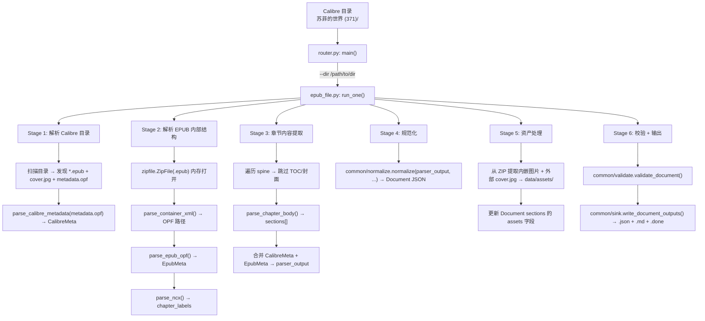
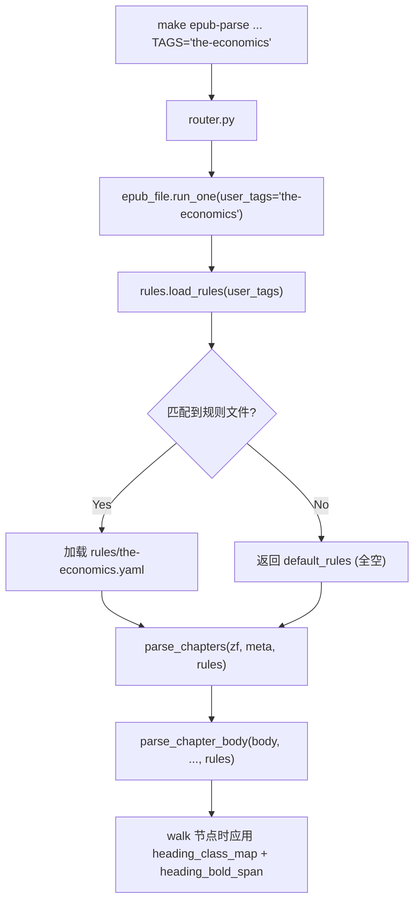

# raw_epub_parse 技术实现方案

> **目标读者**：实现者（LLM / 开发者）  
> **定位**：本文档是可直接指导编码的详细技术规格，与 `PLAN.md`（可行性分析）互补  
> **测试数据**：`knowledge-core/tmp/苏菲的世界 (371)/`（Calibre 标准目录，《苏菲的世界》，EPUB2，36章，中文）

## 文档信息

| 项目         | 内容                               |
| ------------ | ---------------------------------- |
| **文档标题** | raw_epub_parse 技术实现方案        |
| **文档版本** | v3.0                               |
| **创建日期** | 2026-05-03                         |
| **更新日期** | 2026-05-03                         |
| **文档作者** | convexwf                           |
| **文档类型** | 技术设计                           |
| **参考资料** | PLAN.md, schemas/document.json     |

## Table of Contents

- [1. 文件结构](#1-文件结构)
- [2. 依赖项](#2-依赖项)
- [3. 数据流全景](#3-数据流全景)
- [4. 输入格式：Calibre 标准目录](#4-输入格式calibre-标准目录)
- [5. 模块规格：epub_file.py](#5-模块规格epub_filepy)
  - [5.1 open_calibre_dir](#51-open_calibre_dir)
  - [5.2 parse_calibre_metadata](#52-parse_calibre_metadata)
  - [5.3 parse_epub_opf](#53-parse_epub_opf)
  - [5.4 parse_ncx](#54-parse_ncx)
  - [5.5 parse_chapters](#55-parse_chapters)
  - [5.6 parse_chapter_body](#56-parse_chapter_body)
  - [5.7 skip_heuristics](#57-skip_heuristics)
  - [5.8 resolve_inline_src](#58-resolve_inline_src)
  - [5.9 run_one](#59-run_one)
- [6. 模块规格：router.py](#6-模块规格routerpy)
- [7. 自包含公共模块：common/](#7-自包含公共模块common)
  - [7.1 paths.py](#71-pathspy)
  - [7.2 normalize.py](#72-normalizepy)
  - [7.3 sink.py](#73-sinkpy)
  - [7.4 validate.py](#74-validatepy)
- [8. Makefile 集成](#8-makefile-集成)
- [9. 测试验证计划](#9-测试验证计划)
- [10. 边界情况与错误处理](#10-边界情况与错误处理)
- [11. 标签驱动规则系统](#11-标签驱动规则系统)

---

## 1. 文件结构

```
raw_epub_parse/
  ├── README.md              # 模块说明
  ├── PLAN.md                # 可行性分析
  ├── IMPLEMENTATION.md      # 本文档，详细技术实现方案
  ├── requirements.txt       # Python 依赖
  ├── common/                # 自包含公共模块（不依赖 raw_ingest/）
  │   ├── __init__.py
  │   ├── paths.py           # REPO_ROOT 路径解析
  │   ├── normalize.py       # parser_output → Document schema
  │   ├── sink.py            # Document → Markdown + 文件写入
  │   └── validate.py        # JSON Schema 校验
  ├── rules/                 # 标签驱动解析规则（YAML）
  │   └── the-economics.yaml # 示例：Economist EPUB 特殊规则
  └── sources/
        ├── __init__.py
        ├── router.py        # CLI 入口 + 分发器
        ├── epub_file.py     # 核心：Calibre 目录 → parser_output → Document
        ├── rules.py         # 规则加载引擎
        └── supported_sources.txt
```

**设计原则**：`raw_epub_parse` 完全自包含，不依赖 `raw_ingest/common/`、`raw_paper_parse/` 或 `ingest/`。必要的共享逻辑以 vendored 形式存放在 `common/` 目录下，改编自对应的 `raw_ingest/common/` 模块。

---

## 2. 依赖项

### requirements.txt

```text
lxml>=5.0
beautifulsoup4>=4.12.0
jsonschema>=4.0
```

### 外部依赖明细

| 包 | 用途 | 类型 |
|----|------|------|
| `zipfile` | 解压 EPUB 容器 | 标准库 |
| `xml.etree.ElementTree` | 解析 OPF、container.xml、NCX、Calibre metadata.opf | 标准库 |
| `io` | 内存中的 ZIP 操作 | 标准库 |
| `pathlib` | 跨平台路径处理 | 标准库 |
| `os` | 路径拼接、目录遍历 | 标准库 |
| `hashlib` | 资产 SHA256 标识 | 标准库 |
| `json` | JSON 读写 | 标准库 |
| `uuid` | 生成标识符 | 标准库 |
| `datetime` | 时间戳 | 标准库 |
| `typing` | 类型注解 | 标准库 |
| `sys` | 标准输出/错误 | 标准库 |
| `lxml` | BS4 XML/XHTML 后端 | pip |
| `beautifulsoup4` | XHTML 章节解析 | pip |
| `jsonschema` | Document schema 校验 | pip |

### 无内部模块依赖

`raw_epub_parse` 不从以下模块导入任何代码：
- `raw_ingest/`
- `ingest/`
- `raw_paper_parse/`

唯一引用的外部文件是 `schemas/document.json`（通过相对路径 `../../schemas/document.json` 从 `common/` 访问）。

---

## 3. 数据流全景



**核心设计决策变更 v2.0（相对 v1.0）**：

| 决策 | v1.0（旧） | v2.0（新） | 变更原因 |
|------|-----------|-----------|----------|
| 输入格式 | 单个 `.epub` 文件 | Calibre 标准目录 | 实际数据源为 Calibre 管理的目录，不是裸 epub |
| 元数据来源 | EPUB 内部 OPF | Calibre `metadata.opf`（优先）+ EPUB OPF（兜底） | Calibre metadata 更丰富（含 ISBN、Douban ID、description、subjects 等） |
| 封面来源 | EPUB 内嵌图片 | 外部 `cover.jpg`（优先）+ EPUB 内嵌（兜底） | Calibre 导出时封面外置为独立文件 |
| 模块依赖 | 引用 `raw_ingest/common/`（通过 sys.path） | 完全自包含，vendored 到 `common/` | 消除跨模块耦合，独立部署 |
| RawDoc 存储 | 存储 `.epub` 原始字节 | 不存储 RawDoc（Phase 1 跳过） | 简化流程，直接输出 Document；RawDoc 逻辑留待 Phase 2 |

---

## 4. 输入格式：Calibre 标准目录

### 目录结构

Calibre 按 `{书名} ({id})` 格式命名目录，内部包含三个标准文件：

```
苏菲的世界 (371)/
  ├── metadata.opf                         # Calibre 元数据（独立于 EPUB 内部 OPF）
  ├── cover.jpg                            # 封面图片（外部文件）
  └── 苏菲的世界 - 乔斯坦·贾德.epub       # EPUB 电子书文件
```

### metadata.opf（Calibre）

```xml
<package xmlns="http://www.idpf.org/2007/opf" version="2.0">
  <metadata xmlns:dc="http://purl.org/dc/elements/1.1/" xmlns:opf="http://www.idpf.org/2007/opf">
    <!-- 标识符 -->
    <dc:identifier opf:scheme="calibre" id="calibre_id">371</dc:identifier>
    <dc:identifier opf:scheme="uuid" id="uuid_id">d66576e9-...</dc:identifier>
    <dc:identifier opf:scheme="ISBN">9787506341271</dc:identifier>
    <dc:identifier opf:scheme="NEW_DOUBAN">2284311</dc:identifier>
    <!-- 元数据 -->
    <dc:title>苏菲的世界</dc:title>
    <dc:creator opf:role="aut">乔斯坦·贾德</dc:creator>
    <dc:creator opf:role="aut">萧宝森</dc:creator>
    <dc:date>2007-09-30T16:00:00+00:00</dc:date>
    <dc:publisher>作家出版社</dc:publisher>
    <dc:language>zho</dc:language>
    <dc:subject>哲学</dc:subject>
    <dc:subject>小说</dc:subject>
    <dc:description>&lt;div&gt;&lt;p&gt;...&lt;/p&gt;&lt;/div&gt;</dc:description>
    <!-- Calibre 自定义列 -->
    <meta name="calibre:title_sort" content="苏菲的世界"/>
    <meta name="calibre:user_metadata:#pages" content="{...页数: 326...}"/>
    <meta name="calibre:user_metadata:#words" content="{...字数: 164104...}"/>
  </metadata>
  <guide>
    <reference type="cover" title="封面" href="cover.jpg"/>
  </guide>
</package>
```

**关键字段解读**：

| 字段 | 路径 | 说明 |
|------|------|------|
| Calibre ID | `dc:identifier[opf:scheme="calibre"]` | Calibre 内部 ID（即目录名中的数字） |
| ISBN | `dc:identifier[opf:scheme="ISBN"]` | 国际标准书号 |
| Douban ID | `dc:identifier[opf:scheme="NEW_DOUBAN"]` | 豆瓣读书 ID |
| 书名 | `dc:title` | 不含系列名，比 EPUB 内部更干净 |
| 作者 | `dc:creator[opf:role="aut"]` | 可能有多个 creator 元素 |
| 页数 | `calibre:user_metadata:#pages` | 需解析 JSON 内嵌值 |
| 字数 | `calibre:user_metadata:#words` | 需解析 JSON 内嵌值 |
| 描述 | `dc:description` | HTML 格式，需 strip tags |
| 标签/主题 | `dc:subject` | 可能有多个 |

### 目录发现逻辑

```python
def scan_calibre_dir(dir_path: Path) -> CalibreDir:
    """
    扫描 Calibre 标准目录，识别三个标准文件。

    Returns:
        CalibreDir(epub_path, cover_path, metadata_opf_path)
    """
    files = list(dir_path.iterdir())

    epub_path = None
    cover_path = None
    metadata_path = None

    for f in files:
        if f.suffix.lower() == ".epub":
            epub_path = f
        elif f.name.lower() == "cover.jpg":
            cover_path = f
        elif f.name.lower() == "metadata.opf":
            metadata_path = f

    if not epub_path:
        raise FileNotFoundError(f"No .epub file found in {dir_path}")

    return CalibreDir(
        dir_path=dir_path,
        epub_path=epub_path,
        cover_path=cover_path,      # 可能为 None
        metadata_opf_path=metadata_path,  # 可能为 None
    )
```

### 数据结构

```python
CalibreDir = namedtuple("CalibreDir", [
    "dir_path",              # Path — Calibre 目录完整路径
    "epub_path",             # Path — .epub 文件路径
    "cover_path",            # Path | None — cover.jpg 路径
    "metadata_opf_path",     # Path | None — metadata.opf 路径
])

CalibreMeta = namedtuple("CalibreMeta", [
    "calibre_id",            # str — Calibre 内部 ID
    "isbn",                  # str — ISBN
    "douban_id",             # str — 豆瓣 ID
    "title",                 # str — 书名
    "creators",              # list[str] — 作者列表
    "publisher",             # str — 出版社
    "date",                  # str — 出版日期
    "language",              # str — 语言代码
    "subjects",              # list[str] — 主题/标签
    "description",           # str — 内容简介（已 strip HTML）
    "pages",                 # int | None — 页数
    "word_count",            # int | None — 字数
    "title_sort",            # str — 排序用标题
])

EpubMeta = namedtuple("EpubMeta", [
    "title",                 # str — EPUB 内部 OPF 标题
    "creators",              # list[str] — EPUB 内部作者
    "language",              # str — EPUB 内部语言
    "publisher",             # str — EPUB 内部出版社
    "date",                  # str — EPUB 内部日期
    "identifier",            # str — EPUB 内部标识符（ASIN/UUID）
    "spine_items",           # list[ManifestItem] — 按 spine 顺序
    "manifest_items",        # dict[str, ManifestItem]
    "cover_image_id",        # str | None — 封面图片的 manifest id
    "opf_root",              # str — OPF 所在目录路径
    "chapter_labels",        # dict[str, str] — NCX 章节标题映射
])

ManifestItem = namedtuple("ManifestItem", ["id", "href", "media_type"])
```

### 元数据合并策略

```python
def merge_metadata(calibre: CalibreMeta | None, epub: EpubMeta) -> dict:
    """
    元数据优先级：
    1. Calibre metadata.opf（更丰富、更干净）
    2. EPUB 内部 OPF（兜底）
    """
    c = calibre
    return {
        "title": (c.title if c else None) or epub.title or "Untitled",
        "authors": _pick_nonempty(c.creators if c else None, epub.creators),
        "language": _normalize_lang((c.language if c else None) or epub.language),
        "published_at": _pick_nonempty_string(
            (c.date if c else None), epub.date
        ),
        "tags": _pick_nonempty(c.subjects if c else None, []),
    }
```

---

## 5. 模块规格：epub_file.py

`epub_file.py` 是核心模块，负责 Calibre 目录到 Document 的完整转换。

### 5.1 open_calibre_dir

```python
def open_calibre_dir(dir_path: str | Path) -> tuple[CalibreDir, CalibreMeta | None, EpubMeta, zipfile.ZipFile]:
    """
    打开 Calibre 目录，解析元数据和 EPUB 结构。

    Args:
        dir_path: Calibre 目录路径（如 "tmp/苏菲的世界 (371)"）

    Returns:
        (calibre_dir, calibre_meta, epub_meta, zipfile_instance)

    Raises:
        FileNotFoundError: 目录不存在 或 无 .epub 文件
        ValueError: 无法解析 metadata.opf 或 EPUB 内部 OPF
        zipfile.BadZipFile: EPUB 文件不是有效 ZIP
    """
```

**流程**：

```python
dir_path = Path(dir_path)
if not dir_path.is_dir():
    raise FileNotFoundError(f"Not a directory: {dir_path}")

# 1. 扫描目录
cd = _scan_calibre_dir(dir_path)

# 2. 解析 Calibre metadata.opf（可选）
calibre_meta = None
if cd.metadata_opf_path and cd.metadata_opf_path.is_file():
    try:
        calibre_meta = parse_calibre_metadata(cd.metadata_opf_path)
    except Exception as e:
        print(f"WARNING: Failed to parse Calibre metadata: {e}", file=sys.stderr)

# 3. 打开 EPUB
epub_bytes = cd.epub_path.read_bytes()
zf = zipfile.ZipFile(io.BytesIO(epub_bytes))

# 4. 解析 EPUB 内部结构
opf_path = _parse_container_xml(zf)
epub_meta = parse_epub_opf(zf, opf_path)
parse_ncx(zf, epub_meta)

return cd, calibre_meta, epub_meta, zf
```

---

### 5.2 parse_calibre_metadata

```python
def parse_calibre_metadata(opf_path: Path) -> CalibreMeta:
    """
    解析 Calibre 的 metadata.opf 文件。

    与 EPUB 内部 OPF 不同，Calibre 的 metadata.opf 包含更丰富的元数据：
    - 多个 identifier（ISBN、Calibre ID、Douban ID）
    - description（HTML 格式的内容简介）
    - subject 标签
    - 自定义列（#pages、#words、#mark）

    命名空间:
        opf: http://www.idpf.org/2007/opf
        dc:  http://purl.org/dc/elements/1.1/
    """
```

**实现要点**：

```python
import json
import re
from xml.etree import ElementTree as ET

NS = {
    "opf": "http://www.idpf.org/2007/opf",
    "dc":  "http://purl.org/dc/elements/1.1/",
}

tree = ET.parse(str(opf_path))
root = tree.getroot()

# --- 标识符 ---
calibre_id = ""
isbn = ""
douban_id = ""
uuid_str = ""

for el in root.iterfind(".//dc:identifier", NS):
    scheme = el.get("{http://www.idpf.org/2007/opf}scheme", "").lower()
    text = (el.text or "").strip()
    if scheme == "calibre":
        calibre_id = text
    elif scheme == "isbn":
        isbn = text
    elif scheme in ("new_douban", "douban"):
        douban_id = text
    elif scheme == "uuid":
        uuid_str = text

# --- 基本元数据 ---
metadata = root.find("opf:metadata", NS)
if metadata is None:
    metadata = root

def _text(tag: str) -> str:
    el = metadata.find(tag, NS)
    return (el.text or "").strip() if el is not None and el.text else ""

title = _text("dc:title")

# creators: 可能有多个
creators = []
for el in metadata.findall("dc:creator", NS):
    role = el.get("{http://www.idpf.org/2007/opf}role", "")
    if role == "aut" or not role:
        name = (el.text or "").strip()
        if name:
            creators.append(name)

publisher = _text("dc:publisher")
date = _text("dc:date")
language = _text("dc:language")

# subjects
subjects = []
for el in metadata.findall("dc:subject", NS):
    s = (el.text or "").strip()
    if s:
        subjects.append(s)

# description: HTML 格式，需 strip tags
description_raw = _text("dc:description")
description = _strip_html(description_raw) if description_raw else ""

# --- Calibre 自定义列 ---
pages = None
word_count = None

for meta_el in metadata.findall("opf:meta", NS):
    name = meta_el.get("name", "")
    content = (meta_el.text or "").strip()
    if name == "calibre:user_metadata:#pages":
        try:
            data = json.loads(content)
            pages = data.get("#value#")
        except json.JSONDecodeError:
            pass
    elif name == "calibre:user_metadata:#words":
        try:
            data = json.loads(content)
            word_count = data.get("#value#")
        except json.JSONDecodeError:
            pass

# title_sort
title_sort = ""
for meta_el in metadata.findall("opf:meta", NS):
    if meta_el.get("name") == "calibre:title_sort":
        title_sort = (meta_el.get("content") or "").strip()
        break

return CalibreMeta(
    calibre_id=calibre_id,
    isbn=isbn,
    douban_id=douban_id,
    title=title,
    creators=creators,
    publisher=publisher,
    date=date,
    language=language,
    subjects=subjects,
    description=description,
    pages=pages,
    word_count=word_count,
    title_sort=title_sort,
)
```

**HTML strip 辅助函数**：

```python
def _strip_html(html_str: str) -> str:
    """去掉 HTML 标签，保留纯文本"""
    # 简单方式（不引入 BeautifulSoup 额外依赖）:
    # 替换常见实体
    text = html_str.replace("&lt;", "<").replace("&gt;", ">").replace("&amp;", "&")
    # 去掉所有标签
    text = re.sub(r"<[^>]+>", " ", text)
    # 合并空白
    text = re.sub(r"\s+", " ", text).strip()
    return text
```

---

### 5.3 parse_epub_opf

```python
def parse_epub_opf(zf: zipfile.ZipFile, opf_path: str) -> EpubMeta:
    """
    解析 EPUB 内部 OPF 包文件，提取元数据、manifest、spine。

    与 Calibre 的 metadata.opf 不同，EPUB 内部 OPF 还包含 manifest 和 spine
    这些是章节解析所必需的结构信息。

    命名空间：
        opf: http://www.idpf.org/2007/opf
        dc:  http://purl.org/dc/elements/1.1/

    Returns:
        EpubMeta — 包含元数据 + 完整的 manifest/spine 结构
    """
```

**OPF 根目录计算**：

```python
# content.opf 路径如 "content.opf" → opf_root = ""
# 或如 "OEBPS/content.opf" → opf_root = "OEBPS/"
opf_root = os.path.dirname(opf_path)
if opf_root and not opf_root.endswith("/"):
    opf_root += "/"
```

**manifest 解析**：

```python
manifest = {}
for item in root.findall(".//opf:item", NS):
    item_id = item.get("id")
    href = item.get("href")
    media_type = item.get("media-type")
    if item_id and href:
        # 规范化路径：相对于 OPF 根目录
        full_href = os.path.normpath(os.path.join(opf_root, href))
        manifest[item_id] = ManifestItem(item_id, full_href, media_type or "")
```

**spine 解析**：

```python
spine = []
for itemref in root.findall(".//opf:itemref", NS):
    idref = itemref.get("idref")
    if idref and idref in manifest:
        spine.append(manifest[idref])
```

**封面图片**：

```python
cover_id = None
for meta_el in root.findall(".//opf:meta", NS):
    if meta_el.get("name") == "cover":
        cover_id = meta_el.get("content")
        break
```

**元数据提取**（与 Calibre 解析类似但更简单）：

```python
metadata = root.find("opf:metadata", NS) or root

def _txt(tag: str) -> str:
    el = metadata.find(f"dc:{tag}", NS)
    return (el.text or "").strip() if el is not None and el.text else ""

title = _txt("title")
# EPUB 内部 OPF 的 creator 可能是合并字符串，如 "（挪）贾德著；萧宝森译"
creators_raw = _txt("creator")
creators = [c.strip() for c in creators_raw.replace("；", ";").split(";") if c.strip()]
language = _txt("language")
publisher = _txt("publisher")
date = _txt("date")
identifier = _txt("identifier")
```

---

### 5.4 parse_ncx

与 v1.0 方案一致（见 IMPLEMENTATION.md v1.0 中的 §4.4），无需变更。NCX 解析结果填充到 `epub_meta.chapter_labels` 字典中。

```python
NS_NCX = "http://www.daisy.org/z3986/2005/ncx/"

def parse_ncx(zf: zipfile.ZipFile, meta: EpubMeta) -> None:
    """
    解析 EPUB2 的 NCX 文件，提取章节标题映射。

    修改 meta.chapter_labels 字段（in-place）。
    对于 EPUB3 或无 NCX 的情况，静默返回。
    """
    ncx_item = None
    for item in meta.manifest_items.values():
        if item.media_type == "application/x-dtbncx+xml":
            ncx_item = item
            break

    if not ncx_item:
        return

    try:
        raw = zf.read(ncx_item.href).decode("utf-8")
    except Exception:
        return

    root = ET.fromstring(raw)
    chapter_labels = {}

    for navpoint in root.iter(f"{{{NS_NCX}}}navPoint"):
        label_el = navpoint.find(f"{{{NS_NCX}}}navLabel/{{{NS_NCX}}}text")
        content_el = navpoint.find(f"{{{NS_NCX}}}content")
        if label_el is not None and content_el is not None:
            title = (label_el.text or "").strip()
            src = content_el.get("src", "")
            # 去掉 URL fragment（如 #id）
            src = src.split("#")[0]
            if title and src:
                # 规范化路径
                chapter_dir = os.path.dirname(ncx_item.href)
                full_src = os.path.normpath(os.path.join(chapter_dir, src))
                chapter_labels[full_src] = title

    meta = meta._replace(chapter_labels=chapter_labels)
```

---

### 5.5 parse_chapters

```python
def parse_chapters(
    zf: zipfile.ZipFile,
    meta: EpubMeta,
    filter_skippable: bool = True,
) -> dict[str, Any]:
    """
    按 OPF spine 顺序遍历所有章节，解析 XHTML 为 sections。

    Args:
        zf: EPUB ZipFile 实例
        meta: EpubMeta（包含 spine_items, chapter_labels, opf_root）
        filter_skippable: 是否自动跳过 TOC页/封面页

    Returns:
        parser_output = {
            "meta": {...},
            "sections": [...],
            "parser_version": "raw_epub_parse.epub_file 0.1.0",
        }
    """
```

**流程**：

```python
all_sections = []
sid = 0

def next_id(prefix: str) -> str:
    nonlocal sid
    sid += 1
    return f"{prefix}-{sid}"

for item in meta.spine_items:
    # 只处理 XHTML/HTML 类型
    if not ("html" in item.media_type.lower() or "xhtml" in item.media_type.lower()):
        continue

    # 读取章节文件
    try:
        raw = zf.read(item.href).decode("utf-8", errors="replace")
    except Exception:
        print(f"WARNING: Cannot read chapter {item.href}", file=sys.stderr)
        continue

    # 跳过判断
    if filter_skippable and should_skip_chapter(raw, item, meta):
        continue

    # 解析 body
    soup = BeautifulSoup(raw, "lxml")
    body = soup.find("body")
    if not body:
        continue

    # 章节标题：优先用 NCX 标签
    chapter_title = meta.chapter_labels.get(item.href)
    if chapter_title and chapter_title != "目录":
        all_sections.append({
            "section_id": next_id("h"),
            "type": "heading",
            "level": 2,
            "content": chapter_title,
        })

    # 解析 body 内容（若有 NCX 标题，跳过 body 内重复的 h1）
    chapter_sections = parse_chapter_body(
        body, next_id, meta,
        skip_first_h1=(chapter_title is not None),
    )
    all_sections.extend(chapter_sections)
```

**跳过策略补充**：对于 test.epub，`text/part0000.html`（目录页）的 NCX 标签为 "目录"。在 Section 标题插入时通过 `chapter_title != "目录"` 条件过滤。同时 `should_skip_chapter` 也会因其 link density 过高而返回 True。

---

### 5.6 parse_chapter_body

```python
def parse_chapter_body(
    body: Tag,
    next_id: Callable[[str], str],
    meta: EpubMeta,
    skip_first_h1: bool = False,
) -> list[dict[str, Any]]:
    """
    解析单个章节的 XHTML body，提取结构化 sections。

    提取规则（按 DOM 遍历顺序）：

    | HTML 元素          | 输出 section 类型 | 说明                                    |
    |-------------------|------------------|-----------------------------------------|
    | <h1> ~ <h6>       | heading          | level 从标签名获取；若 skip_first_h1 则跳过第一个 |
    | <p>               | paragraph        | 取 strip 后的文本；空段落跳过            |
    |              | figure           | src 解析为 ZIP 内相对路径               |
    | <ul> / <ol>       | list             | items 列表                              |
    | <table>           | table            | rows 二维数组                           |
    | <pre> / <code>    | code             | 保留换行和缩进                          |
    | <blockquote>      | paragraph        | 递归解析子元素                          |
    | <div>/<section>/<span>/<a>/<em>/<strong> | — | 递归遍历子元素 |
    """
```

**实现**（核心逻辑——递归 walk）：

```python
sections = []
_skipped_first_h1 = False

def walk(node):
    nonlocal _skipped_first_h1
    if isinstance(node, NavigableString):
        return

    tag_name = node.name

    if tag_name in ("h1", "h2", "h3", "h4", "h5", "h6"):
        if skip_first_h1 and not _skipped_first_h1 and tag_name == "h1":
            _skipped_first_h1 = True
            return
        text = node.get_text(" ", strip=True)
        if text:
            level = int(tag_name[1])
            sections.append({
                "section_id": next_id("h"),
                "type": "heading",
                "level": level,
                "content": text,
            })

    elif tag_name == "p":
        text = node.get_text(" ", strip=True)
        if text:
            sections.append({
                "section_id": next_id("p"),
                "type": "paragraph",
                "content": text,
            })

    elif tag_name == "img":
        src = (node.get("src") or "").strip()
        alt = (node.get("alt") or "").strip() or None
        if src:
            resolved = resolve_inline_src(src, node, meta)
            sections.append({
                "section_id": next_id("fig"),
                "type": "figure",
                "content": "",
                "assets": [{"caption": alt, "_original_src": resolved}],
            })

    elif tag_name in ("ul", "ol"):
        items = _extract_list_items(node)
        if items:
            sections.append({
                "section_id": next_id("lst"),
                "type": "list",
                "content": "",
                "items": items,
            })

    elif tag_name == "table":
        rows = _extract_table_rows(node)
        if rows:
            sections.append({
                "section_id": next_id("tbl"),
                "type": "table",
                "content": "",
                "rows": rows,
            })

    elif tag_name in ("pre", "code"):
        text = node.get_text()
        if text.strip():
            sections.append({
                "section_id": next_id("cd"),
                "type": "code",
                "content": text.rstrip(),
            })

    else:
        # div, section, article, header, footer, nav, figure, span, a, em, strong, etc.
        for child in node.children:
            walk(child)

for child in body.children:
    walk(child)

return sections
```

**辅助函数**：

```python
def _extract_list_items(tag: Tag) -> list[str]:
    items = []
    for li in tag.find_all("li", recursive=False):
        text = li.get_text(" ", strip=True)
        if text:
            items.append(text)
    return items

def _extract_table_rows(table: Tag) -> list[list[str]]:
    rows = []
    for tr in table.find_all("tr"):
        if tr.find_parent("table") is not table:
            continue
        cells = tr.find_all(["th", "td"])
        if cells:
            rows.append([c.get_text(" ", strip=True) for c in cells])
    return rows
```

---

### 5.7 skip_heuristics

```python
def should_skip_chapter(raw_html: str, item: ManifestItem, meta: EpubMeta) -> bool:
    """
    判断是否应跳过该章节（不在输出中显示）。

    跳过规则：
    1. 封面页 — 检测 <meta name="calibre:cover" content="true"/>
       或 body 内只有 <svg>/<image> 且无实质文本
    2. TOC/目录页 — 检测：
       a. Calibre 生成的 TOC class（sgc-toc-title, sgc-toc-level）
       b. link density > 50%（<a> 标签内文本占总文本比例）
       c. body class/id 中包含 "toc"（不区分大小写）
    3. 版权/出版信息页 — Phase 2 处理
    """
```

**link density 计算**：

```python
soup = BeautifulSoup(raw_html, "lxml")
body = soup.find("body")
if not body:
    return False

# 检测 Calibre TOC class
body_class = " ".join(body.get("class") or [])
toc_classes = ("sgc-toc-title", "sgc-toc-level", "sgc-toc")
if any(tc in body_class for tc in toc_classes):
    return True

# 检测 body id 中的 toc
body_id = (body.get("id") or "").lower()
if "toc" in body_id:
    return True

# link density
total_text = body.get_text(" ", strip=True)
link_text = " ".join(a.get_text(" ", strip=True) for a in body.find_all("a"))

if total_text and len(link_text) / max(len(total_text), 1) > 0.5:
    return True

# 检测 calibre:cover meta
cover_meta = soup.find("meta", attrs={"name": "calibre:cover"})
if cover_meta and cover_meta.get("content") == "true":
    return True

# 检测仅有 svg/image 的封面页
children = [c for c in body.children if isinstance(c, Tag)]
text_content = body.get_text(" ", strip=True)
if len(text_content) < 20 and any(c.name in ("svg", "image") for c in children):
    return True

return False
```

**针对 test.epub 的跳过结果**：

| 文件 | 判断依据 | 结果 |
|------|----------|------|
| `titlepage.xhtml` | calibre:cover meta + body 内仅有 svg | **跳过** |
| `text/part0000.html` | sgc-toc-title + sgc-toc-level + 全由 `<a>` 组成 | **跳过** |
| `text/part0001~0035.html` | 正常文本段落 | **保留** |
| `cover.jpg`（外部文件） | 非 XHTML，不在 spine 中 | 单独处理（见 5.9） |

---

### 5.8 resolve_inline_src

```python
def resolve_inline_src(src: str, img_tag: Tag, meta: EpubMeta) -> str:
    """
    将 EPUB 内嵌图片的 src 属性解析为 ZIP 内的完整路径。

    所有路径最终相对于 OPF 根目录。

    例如:
    - 在 text/part0001.html 中 
      章节所在目录 = "text/"
      → os.path.normpath("text/../cover.jpeg") = "cover.jpeg"

    - 在 chapter.xhtml 中 
      章节在 OEBPS/chapter.xhtml → src 为 "images/fig1.png"
      → os.path.normpath("OEBPS/images/fig1.png") = "OEBPS/images/fig1.png"
    """
```

```python
import os.path

# item.href 如 "text/part0001.html" 或 "titlepage.xhtml"
# 获取章节文件所在目录
chapter_dir = os.path.dirname(item.href)  # 如 "text" 或 ""

# 图片路径相对于章节文件解析后再相对于 OPF 根
resolved = os.path.normpath(os.path.join(chapter_dir, src.strip()))
return resolved
```

---

### 5.9 run_one

```python
def run_one(
    dir_path: str,
    canonical_url: str,
    rawdocs_dir: Path,        # 保留接口兼容性，Phase 1 不使用
    assets_dir: Path,
    docs_dir: Path,
    timeout: int,              # 保留接口兼容性
    do_validate: bool,
    *,
    work_id: str = "",
    variant: str = "book",
    write_rawdoc: bool = False,  # Phase 1 默认 False
) -> None:
    """
    处理单个 Calibre 目录的完整流水线。

    Args:
        dir_path: Calibre 目录路径
        canonical_url: 来源 URI
        rawdocs_dir: 保留参数（Phase 1 不写 RawDoc）
        assets_dir: data/assets/ 目录
        docs_dir: data/docs/ 目录
        timeout: 保留参数
        do_validate: 是否执行 JSON Schema 校验
        work_id: 逻辑作品 ID
        variant: 变体标识（默认 "book"）
        write_rawdoc: 是否写入 RawDoc（Phase 1 默认不写入）
    """
```

**完整实现流程**：

```python
import json
import hashlib
import io
import os
import sys
import zipfile
from pathlib import Path

# 自包含导入
from common.paths import REPO_ROOT
from common.normalize import normalize
from common.sink import write_document_outputs
from common.validate import validate_document

# 1. 打开 Calibre 目录
calibre_dir, calibre_meta, epub_meta, zf = open_calibre_dir(dir_path)
source_uri = canonical_url or f"file://{calibre_dir.dir_path.resolve()}"

# 2. 合并元数据
merged_meta = merge_metadata(calibre_meta, epub_meta)

# 3. 提取章节内容
parser_output = parse_chapters(zf, epub_meta)

# 补充书籍级元数据
parser_output["meta"]["title"] = parser_output["meta"].get("title") or merged_meta["title"] or "Untitled"
parser_output["meta"]["authors"] = parser_output["meta"].get("authors") or merged_meta["authors"]
parser_output["meta"]["language"] = parser_output["meta"].get("language") or merged_meta["language"]
parser_output["meta"]["published_at"] = parser_output["meta"].get("published_at") or merged_meta["published_at"] or None
parser_output["meta"]["parser_version"] = "raw_epub_parse.epub_file 0.1.0"

# tags
tags = list(parser_output["meta"].get("tags") or [])
tags.extend(merged_meta.get("tags") or [])
tags.append(f"book:variant:{variant}")
if work_id:
    tags.append(f"book:work_id:{work_id}")
if calibre_meta:
    if calibre_meta.isbn:
        tags.append(f"book:isbn:{calibre_meta.isbn}")
    if calibre_meta.douban_id:
        tags.append(f"book:douban:{calibre_meta.douban_id}")
parser_output["meta"]["tags"] = tags

# 4. 规范化
doc_id = str(uuid.uuid4())
rawdoc_id = doc_id  # Phase 1: 简化，不区分 rawdoc_id 和 doc_id

doc = normalize(
    parser_output,
    rawdoc_id=rawdoc_id,
    storage_path=str(calibre_dir.epub_path.resolve()),
    source_uri=source_uri,
    source_type="epub",
)

# 5. 资产处理
doc = _process_assets(doc, zf, calibre_dir, assets_dir)

# 6. 校验
if do_validate:
    validate_document(doc, REPO_ROOT)

# 7. 输出
json_path, md_path = write_document_outputs(
    doc, docs_dir, rawdocs_dir, rawdoc_id, write_done=False,
)

print(
    f"doc_id={doc_id} doc_json={json_path} doc_md={md_path}",
    flush=True,
)
```

**资产处理函数**：

```python
def _process_assets(
    doc: dict[str, Any],
    zf: zipfile.ZipFile,
    calibre_dir: CalibreDir,
    assets_dir: Path,
) -> dict[str, Any]:
    """
    处理 EPUB 内嵌图片和外部封面图片：

    1. 遍历所有 type=="figure" 的 sections
    2. 对每个 asset：
       a. 如果 _original_src 在 ZIP 中存在 → 从 ZIP 读取
       b. 如果不存在 → 跳过
    3. 如果有外部 cover.jpg → 在前面插入封面 figure section
    4. 计算 SHA256 前缀为 asset_id
    5. 写入 assets/{asset_id}{ext}
    6. 更新 Document 的 assets 字段
    """
    doc = dict(doc)
    sections = list(doc.get("sections") or [])
    assets_dir.mkdir(parents=True, exist_ok=True)

    # 处理 ZIP 内嵌图片
    for sec in sections:
        if sec.get("type") != "figure" or not sec.get("assets"):
            continue
        new_assets = []
        for a in sec["assets"]:
            orig = (a.get("_original_src") or "").strip()
            if not orig:
                new_assets.append({"asset_id": "", "path": "", "caption": a.get("caption")})
                continue
            try:
                data = zf.read(orig)
            except (KeyError, OSError):
                new_assets.append({"asset_id": "", "path": "", "caption": a.get("caption")})
                continue

            ext = os.path.splitext(orig)[1].lower() or ".png"
            h = hashlib.sha256(data[:65536]).hexdigest()[:16]
            asset_id = f"{h}{ext}"
            (assets_dir / asset_id).write_bytes(data)

            new_assets.append({
                "asset_id": asset_id,
                "path": f"assets/{asset_id}",
                "caption": a.get("caption"),
            })
        sec["assets"] = new_assets

    # 处理外部封面（优先级高于 EPUB 内嵌封面）
    if calibre_dir.cover_path and calibre_dir.cover_path.is_file():
        cover_data = calibre_dir.cover_path.read_bytes()
        ext = ".jpg"
        h = hashlib.sha256(cover_data[:65536]).hexdigest()[:16]
        asset_id = f"{h}{ext}"
        (assets_dir / asset_id).write_bytes(cover_data)

        cover_section = {
            "section_id": "cover",
            "type": "figure",
            "content": "",
            "items": [],
            "rows": [],
            "assets": [{
                "asset_id": asset_id,
                "path": f"assets/{asset_id}",
                "caption": "Cover",
            }],
            "annotations": {},
        }
        # 如果已有封面 figure（来自 EPUB 内嵌），替换；否则插入最前面
        has_cover = any(
            s.get("type") == "figure" and s.get("section_id") == "cover"
            for s in sections
        )
        if has_cover:
            for i, s in enumerate(sections):
                if s.get("section_id") == "cover":
                    sections[i] = cover_section
                    break
        else:
            sections.insert(0, cover_section)

    doc["sections"] = sections
    return doc
```

---

## 6. 模块规格：router.py

```python
#!/usr/bin/env python3
"""
Route Calibre directory paths to raw_epub_parse source parsers.

Single directory:
    python sources/router.py --dir "tmp/苏菲的世界 (371)"

Batch:
    python sources/router.py --urls-file path/to/batch.tsv

Run from repo root:
    make epub-parse DIR="tmp/苏菲的世界 (371)"
"""
from __future__ import annotations

import argparse
import importlib
import sys
import time
from collections.abc import Callable
from pathlib import Path

RunOne = Callable[..., None]

_SOURCES_FILE = Path(__file__).with_name("supported_sources.txt")
_REGISTRY: dict[str, RunOne] | None = None
_BATCH_DELAY_SEC = 0.0


def _load_registry() -> dict[str, RunOne]:
    global _REGISTRY
    if _REGISTRY is not None:
        return _REGISTRY

    # 硬编码注册：*.epub 和 directory 两种模式都走 epub_file
    import epub_file
    _REGISTRY = {
        "*.epub":  epub_file.run_one,
        "dir":     epub_file.run_one,
    }
    # 同时从 supported_sources.txt 加载（可扩展）
    if _SOURCES_FILE.is_file():
        for line in _SOURCES_FILE.read_text(encoding="utf-8").splitlines():
            line = line.strip()
            if not line or line.startswith("#") or "\t" not in line:
                continue
            pattern, mod = line.split("\t", 1)
            pattern = pattern.strip().lower()
            mod = mod.strip().removesuffix(".py")
            if not pattern or not mod:
                continue
            m = importlib.import_module(mod)
            _REGISTRY[pattern] = m.run_one
    return _REGISTRY


def resolve_run_one(input_path: str) -> RunOne | None:
    reg = _load_registry()
    path_lower = input_path.lower()

    p = Path(input_path)
    if p.is_dir():
        return reg.get("dir")
    if path_lower.endswith(".epub"):
        return reg.get("*.epub")
    return None


def main() -> None:
    _load_registry()

    ap = argparse.ArgumentParser(
        description="Parse Calibre EPUB directories into Document schema",
    )
    ap.add_argument("--dir", default="", help="Calibre book directory path")
    ap.add_argument("--file", default="", help="Single .epub file (legacy compat)")
    ap.add_argument("--canonical-url", default="", help="source_uri override")
    ap.add_argument("--work-id", default="", help="Logical work id")
    ap.add_argument("--variant", default="book", help="book|article|...")
    ap.add_argument("--urls-file", default="", help="Batch: one path per line")
    ap.add_argument("--rawdocs", default=None, help="RawDocs dir (Phase 1 unused)")
    ap.add_argument("--assets", default=None, help="Assets dir")
    ap.add_argument("--docs", default=None, help="Docs dir")
    ap.add_argument("--timeout", type=int, default=60, help="Timeout (reserved)")
    ap.add_argument("--no-validate", action="store_true", help="Skip schema validation")
    args = ap.parse_args()

    from common.paths import REPO_ROOT

    rawdocs_dir = Path(args.rawdocs or REPO_ROOT / "data" / "rawdocs")
    assets_dir = Path(args.assets or REPO_ROOT / "data" / "assets")
    docs_dir = Path(args.docs or REPO_ROOT / "data" / "docs")
    do_validate = not args.no_validate

    single = (args.dir or args.file or "").strip()

    if args.urls_file and single:
        print("Use either --urls-file or --dir/--file, not both", file=sys.stderr)
        sys.exit(2)

    jobs: list[tuple[str, str, str, str]] = []  # (work_id, variant, path, canonical)

    if args.urls_file:
        p = Path(args.urls_file)
        if not p.is_file():
            print(f"URLs file not found: {p}", file=sys.stderr)
            sys.exit(1)
        for line in p.read_text(encoding="utf-8").splitlines():
            line = line.strip()
            if not line or line.startswith("#"):
                continue
            parts = [x.strip() for x in line.split("\t")]
            if len(parts) >= 3:
                wid, var, epath = parts[0], parts[1], parts[2]
                canonical = parts[3] if len(parts) > 3 else f"file://{Path(epath).resolve()}"
            else:
                epath = parts[0]
                canonical = f"file://{Path(epath).resolve()}"
                wid = ""
                var = "book"
            jobs.append((wid, var, epath, canonical))
        if not jobs:
            print(f"No valid jobs in file: {p}", file=sys.stderr)
            sys.exit(1)
    else:
        if not single:
            print(
                "Usage: python sources/router.py --dir '/path/to/Calibre Dir (id)'\n"
                "   or: python sources/router.py --file /path/to/book.epub",
                file=sys.stderr,
            )
            sys.exit(2)
        canonical = args.canonical_url.strip() or f"file://{Path(single).resolve()}"
        work_id = args.work_id.strip()
        variant = args.variant.strip() or "book"
        jobs = [(work_id, variant, single, canonical)]

    failed = 0
    batch = len(jobs) > 1

    for i, (work_id, variant, input_path, canonical) in enumerate(jobs):
        if batch:
            print(f"--- {input_path}", file=sys.stderr)
        if i > 0:
            time.sleep(_BATCH_DELAY_SEC)

        p = Path(input_path)
        if not (p.is_dir() or p.is_file()):
            print(f"MISSING: {input_path}", file=sys.stderr)
            failed += 1
            continue

        runner = resolve_run_one(input_path)
        if runner is None:
            print(f"UNSUPPORTED: {input_path}", file=sys.stderr)
            failed += 1
            continue

        if not work_id:
            work_id = p.name if p.is_dir() else p.stem

        try:
            runner(
                input_path,
                canonical,
                rawdocs_dir,
                assets_dir,
                docs_dir,
                args.timeout,
                do_validate,
                work_id=work_id,
                variant=variant,
            )
        except Exception as e:
            import traceback
            traceback.print_exc(file=sys.stderr)
            print(f"error: {e}", file=sys.stderr)
            failed += 1

    if failed:
        sys.exit(1)


if __name__ == "__main__":
    main()
```

### supported_sources.txt

```text
# raw_epub_parse source registry
# pattern\tmodule
*.epub	epub_file
```

---

## 7. 自包含公共模块：common/

### 7.1 paths.py

```python
"""Resolve repository root path (vendored from raw_ingest/common/repo_paths.py)."""
from pathlib import Path

# common/ → raw_epub_parse/ → knowledge-core/
REPO_ROOT = Path(__file__).resolve().parents[2]

def schemas_dir() -> Path:
    return REPO_ROOT / "schemas"
```

**路径解析验证**：
- `common/paths.py` 的 `parents[2]` = `raw_epub_parse/` 上两级 = `knowledge-core/`
- `schemas/document.json` 通过 `REPO_ROOT / "schemas" / "document.json"` 访问

### 7.2 normalize.py

从 `raw_ingest/common/normalize_doc.py` 直接 vendored，删去 `# Vendored from ...` 注释，保持功能完全一致。

```python
"""
Map parser output to Document schema.
"""
import uuid
from datetime import datetime, timezone
from typing import Any


def normalize(
    parser_output: dict[str, Any],
    rawdoc_id: str,
    storage_path: str,
    source_uri: str,
    source_type: str = "epub",
) -> dict[str, Any]:
    meta = parser_output.get("meta") or {}
    sections_in = parser_output.get("sections") or []
    parser_version = parser_output.get("parser_version") or "0.1.0"

    doc_id = str(uuid.uuid4())
    ingested_at = datetime.now(timezone.utc).isoformat()

    sections = []
    for i, s in enumerate(sections_in):
        sec = {
            "section_id": s.get("section_id") or f"sec-{i}",
            "type": s.get("type", "paragraph"),
            "content": s.get("content") or "",
            "items": s.get("items") or [],
            "rows": s.get("rows") or [],
            "assets": [],
            "annotations": s.get("annotations") or {},
        }
        if s.get("type") == "heading":
            sec["level"] = s.get("level", 1)
        if s.get("type") == "figure" and s.get("assets"):
            for a in s["assets"]:
                sec["assets"].append({
                    "asset_id": "",
                    "path": "",
                    "caption": a.get("caption"),
                    "_original_src": a.get("original_src") or a.get("_original_src"),
                })
        sections.append(sec)

    out: dict[str, Any] = {
        "doc_id": doc_id,
        "meta": {
            "title": (meta.get("title") or "").strip() or "Untitled",
            "source": {
                "type": source_type,
                "path": storage_path,
                "url": source_uri if source_uri.startswith("http") else None,
                "rawdoc_id": rawdoc_id,
            },
            "authors": meta.get("authors") or [],
            "published_at": meta.get("published_at") or None,
            "updated_at": meta.get("updated_at") or None,
            "ingested_at": ingested_at,
            "language": meta.get("language") or "",
            "tags": meta.get("tags") or [],
            "parser_version": parser_version,
        },
        "sections": sections,
    }
    refs = parser_output.get("references")
    if isinstance(refs, list):
        out["references"] = refs
    return out
```

### 7.3 sink.py

从 `raw_ingest/common/sink_doc.py` 直接 vendored，删去 `.done` 文件写入（Phase 1 不使用 RawDoc poller）。

```python
"""
Write Document JSON and Markdown.
"""
import json
from pathlib import Path
from typing import Any


def _list_item_math_to_md(item: dict[str, Any]) -> str:
    tex = (item.get("math") or "").strip()
    if item.get("display"):
        return f"$$\n{tex}\n$$"
    return f"${tex}$"


def _md_escape_table_cell(s: str) -> str:
    return (s or "").replace("|", "\\|").replace("\n", " ").strip()


def _rows_to_md_table(rows: list[Any]) -> str:
    if not rows:
        return ""
    lines_out: list[str] = []
    for i, row in enumerate(rows):
        if not isinstance(row, list):
            continue
        cells = [_md_escape_table_cell(str(c)) for c in row]
        if not cells:
            continue
        lines_out.append("| " + " | ".join(cells) + " |")
        if i == 0:
            lines_out.append("| " + " | ".join(["---"] * len(cells)) + " |")
    if not lines_out:
        return ""
    return "\n" + "\n".join(lines_out) + "\n"


def _paragraph_items_to_markdown(items: list[Any]) -> str:
    chunks: list[str] = []
    for it in items:
        if isinstance(it, str):
            chunks.append(it)
        elif isinstance(it, dict) and it.get("math") is not None:
            chunks.append(_list_item_math_to_md(it))
        elif isinstance(it, dict) and it.get("cite") is not None:
            continue
        elif isinstance(it, dict) and it.get("table") is not None:
            trows = (it.get("table") or {}).get("rows")
            if trows:
                chunks.append(_rows_to_md_table(trows))
        elif isinstance(it, dict) and it.get("text") is not None:
            chunks.append(it.get("text") or "")

    def _needs_space_between(prev: str, nxt: str) -> bool:
        if not prev or not nxt:
            return False
        pl = prev[-1]
        nf = nxt.lstrip()[:1]
        if not nf:
            return False
        if pl.isalnum() and nf.isalnum():
            return True
        if pl in ".!?:" and nf.isalnum():
            return True
        if pl.isalnum() and nxt.lstrip().startswith("$"):
            return True
        if prev.rstrip().endswith("$") and nf.isalnum():
            return True
        return False

    out: list[str] = []
    for c in chunks:
        if not c:
            continue
        if out and _needs_space_between(out[-1], c):
            out.append(" ")
        out.append(c)
    return "".join(out).strip()


def document_to_markdown(doc: dict[str, Any]) -> str:
    lines = [
        f"# {doc['meta']['title']}\n",
        f"Source: {doc['meta']['source'].get('url') or doc['meta']['source']['path']}\n",
    ]

    def append_list_items(items: list, indent: str = "") -> None:
        for item in items:
            if isinstance(item, dict) and item.get("cite") is not None:
                continue
            elif isinstance(item, dict) and item.get("table") is not None:
                trows = (item.get("table") or {}).get("rows")
                if trows:
                    lines.append(_rows_to_md_table(trows))
            elif isinstance(item, dict) and item.get("math") is not None:
                body = _list_item_math_to_md(item).replace("\n", " ").strip()
                lines.append(indent + "- " + body + "\n")
            elif isinstance(item, dict):
                text = (item.get("text") or "").replace("\n", " ").strip()
                lines.append(indent + "- " + text + "\n")
                if item.get("items"):
                    append_list_items(item["items"], indent + "  ")
            else:
                lines.append(indent + "- " + (str(item) or "").replace("\n", " ") + "\n")

    for s in doc["sections"]:
        if s["type"] == "heading":
            lines.append(f"\n{'#' * s.get('level', 1)} {s.get('content', '')}\n")
        elif s["type"] == "paragraph":
            items = s.get("items") or []
            if items:
                body = _paragraph_items_to_markdown(items)
                if body:
                    lines.append(body + "\n")
            elif s.get("content"):
                lines.append(s["content"] + "\n")
        elif s["type"] == "list" and s.get("items"):
            append_list_items(s["items"])
        elif s["type"] == "table" and s.get("rows"):
            lines.append(_rows_to_md_table(s["rows"]) + "\n")
        elif s["type"] == "code" and s.get("content"):
            lines.append("```\n" + s["content"] + "\n```\n")
        elif s["type"] == "figure" and s.get("assets"):
            for a in s["assets"]:
                path = a.get("path")
                if path:
                    rel = path if path.startswith("assets/") else f"assets/{path}"
                    if not rel.startswith("../"):
                        rel = "../" + rel
                    cap = (a.get("caption") or "").replace("]", "\\]")
                    lines.append(f"\n")
    return "\n".join(lines)


def write_document_outputs(
    doc: dict[str, Any],
    docs_dir: Path,
    rawdocs_dir: Path,   # 保留参数兼容性，Phase 1 不写 .done
    rawdoc_id: str,       # 保留参数兼容性
    write_done: bool = False,
) -> tuple[Path, Path]:
    docs_dir.mkdir(parents=True, exist_ok=True)
    doc_id = doc["doc_id"]
    json_path = docs_dir / f"{doc_id}.json"
    json_path.write_text(json.dumps(doc, ensure_ascii=False, indent=2), encoding="utf-8")
    md_path = docs_dir / f"{doc_id}.md"
    md_path.write_text(document_to_markdown(doc), encoding="utf-8")
    return json_path, md_path
```

### 7.4 validate.py

```python
"""
Optional validation against schemas/document.json.
Vendored from raw_ingest/common/schema_validate.py.
"""
import json
from pathlib import Path
from typing import Any

from jsonschema import Draft202012Validator


def validate_document(doc: dict[str, Any], repo_root: Path) -> None:
    schema_path = repo_root / "schemas" / "document.json"
    with open(schema_path, "r", encoding="utf-8") as f:
        schema = json.load(f)
    Draft202012Validator(schema).validate(doc)
```

---

## 8. Makefile 集成

在 `knowledge-core/Makefile` 中添加（修改 v1.0 版本）：

```makefile
# EPUB parse (see raw_epub_parse/IMPLEMENTATION.md)
EPUB_PARSE_DIR := $(REPO_ROOT)/raw_epub_parse

epub-parse-deps:
	@cd "$(EPUB_PARSE_DIR)" && pip install -q -r requirements.txt

# Calibre 目录模式: make epub-parse DIR="tmp/苏菲的世界 (371)"
# 单文件模式: make epub-parse FILE="path/to/book.epub"
epub-parse: epub-parse-deps
	@if [ -n "$(DIR)" ]; then \
		cd "$(EPUB_PARSE_DIR)" && python sources/router.py \
			--dir "$(DIR)" \
			$(if $(WORK_ID),--work-id "$(WORK_ID)") \
			$(if $(VARIANT),--variant "$(VARIANT)"); \
	elif [ -n "$(FILE)" ]; then \
		cd "$(EPUB_PARSE_DIR)" && python sources/router.py \
			--file "$(abspath $(FILE))" \
			$(if $(WORK_ID),--work-id "$(WORK_ID)") \
			$(if $(VARIANT),--variant "$(VARIANT)"); \
	else \
		echo "Usage: make epub-parse DIR='path/to/Calibre Dir (id)' or make epub-parse FILE='path/to/book.epub'"; exit 1; fi

# 批量模式
epub-parse-batch: epub-parse-deps
	@test -n "$(FILE)" || (echo "Usage: make epub-parse-batch FILE=path/to/batch.tsv"; exit 1)
	@cd "$(EPUB_PARSE_DIR)" && python sources/router.py --urls-file "$(abspath $(FILE))"

# 快速测试（使用 Calibre 目录）
epub-parse-test: epub-parse-deps
	@cd "$(EPUB_PARSE_DIR)" && python sources/router.py \
		--dir "$(REPO_ROOT)/tmp/苏菲的世界 (371)" \
		--work-id "sophies-world" \
		--variant "book"
```

**v2.0 vs v1.0 主要变更**：
- `make epub-parse` 新增 `DIR=` 参数（Calibre 目录模式），与 `FILE=` 互斥
- `make epub-parse-test` 输入改为 Calibre 目录而非单文件

---

## 9. 测试验证计划

### 9.1 测试目标

| 编号 | 验证项 | 通过标准 |
|------|--------|----------|
| T1 | Calibre 目录解析 | 正确识别 .epub / cover.jpg / metadata.opf |
| T2 | Calibre metadata.opf 解析 | title="苏菲的世界", ISBN="9787506341271", Douban="2284311", subjects=["哲学","小说"], pages=326, word_count=164104 |
| T3 | EPUB 内部 OPF 解析 | spine_items 37 项，cover_image_id="cover" |
| T4 | NCX 解析 | chapter_labels 37 条，part0000="目录", part0035="那轰然一响" |
| T5 | chapters 数量 | 36 个 heading（36 章，跳过 TOC 和封面） |
| T6 | 章节标题正确 | 第一个 ## "伊甸园"，最后一个 ## "那轰然一响" |
| T7 | 跳过页正确 | 无 "目录" heading，无 titlepage 内容 |
| T8 | 段落内容完整 | Markdown 总长度 > 50KB |
| T9 | 封面处理 | data/assets/ 有 {sha256}.jpg，Markdown 最前面有 `` |
| T10 | Document JSON 有效 | 通过 `validate_document` 校验 |
| T11 | source_type | Document JSON meta.source.type = "epub" |
| T12 | 元数据正确 | title 不含系列名后缀，authors 两个，language="zh" |
| T13 | tags 完整 | 含 book:isbn:9787506341271, book:douban:2284311 |

### 9.2 验证命令

```bash
# 1. 运行解析
make epub-parse-test

# 2. 获取最新 doc_id
DOC_ID=$(ls -t data/docs/*.json 2>/dev/null | head -1 | xargs basename | sed 's/.json//')
echo "doc_id=$DOC_ID"

# 3. 检查 Document JSON
python3 -c "
import json
with open('data/docs/${DOC_ID}.json') as f:
    doc = json.load(f)
print('title:', doc['meta']['title'])
print('authors:', doc['meta']['authors'])
print('language:', doc['meta']['language'])
print('source_type:', doc['meta']['source']['type'])
print('sections count:', len(doc['sections']))
headings = [s for s in doc['sections'] if s['type'] == 'heading']
print('headings count:', len(headings))
figures = [s for s in doc['sections'] if s['type'] == 'figure']
print('figures count:', len(figures))
print('tags:', doc['meta']['tags'][:10])
"

# 4. 检查封面
echo "=== First 3 heading sections ==="
python3 -c "
import json
with open('data/docs/${DOC_ID}.json') as f:
    doc = json.load(f)
for s in doc['sections'][:5]:
    print(f\"  [{s['type']}] {s.get('content', '')[:60]}...\")
"

# 5. 检查 Markdown 头部
echo "=== Markdown first 10 lines ==="
head -10 "data/docs/${DOC_ID}.md"

# 6. 检查 assets
echo "=== Assets ==="
ls -la data/assets/
```

### 9.3 预期输出示例

```markdown
# 苏菲的世界

Source: file:///home/convexwf/work/uknowledge/knowledge-core/tmp/苏菲的世界 (371)/苏菲的世界 - 乔斯坦·贾德.epub


## 伊甸园

……在某个时刻事物必然从无到有……

苏菲放学回家了。有一段路她和乔安同行，她们谈着有关机器人的问题。乔安认为人的脑子就像一部很先进的电脑，这点苏菲并不太赞同。

...

## 魔术师的礼帽

...

## 那轰然一响

...
```

---

## 10. 边界情况与错误处理

| 场景 | 处理策略 | 错误级别 |
|------|----------|----------|
| Calibre 目录不存在 | `FileNotFoundError`，退出码 1 | ERROR |
| Calibre 目录无 .epub 文件 | `FileNotFoundError`，退出码 1 | ERROR |
| Calibre 目录无 metadata.opf | 静默跳过，仅用 EPUB 内部元数据 | INFO |
| Calibre 目录无 cover.jpg | 静默跳过，尝试从 EPUB 内提取封面 | INFO |
| metadata.opf 格式异常 | 捕获异常，降级为仅用 EPUB 内部元数据 | WARN |
| EPUB 不是有效 ZIP | `zipfile.BadZipFile`，退出码 1 | ERROR |
| EPUB 缺少 container.xml | `ValueError`，退出码 1 | ERROR |
| OPF 文件在 ZIP 中不存在 | `ValueError`，退出码 1 | ERROR |
| OPF 元数据完全缺失 | 默认 title = 目录名, creators = [] | WARN |
| NCX 缺失 | 跳过 NCX，用 body 内 h1 作为章节标题 | INFO |
| EPUB3 (nav.xhtml 而非 NCX) | 同上 | INFO |
| spine 中某文件在 ZIP 中不存在 | 跳过该 item | WARN |
| XHTML 解析失败 | 跳过该章节，打印 traceback | WARN |
| 图片文件不在 ZIP 中 | `_original_src` 保留，资产处理阶段跳过 | WARN |
| 传入 .epub 单文件（非目录） | router 检测 `.epub` 后缀 → `respolve_run_one` 匹配 `*.epub` → 进入 run_one | — |
| 传入非 epub 文件 | router 匹配不到 runner → 打印 UNSUPPORTED | ERROR |
| EPUB 中无有效章节 | sections 为空，Markdown 仅含标题和来源行 | — |

### 语言代码规范化

```python
def _normalize_lang(lang: str) -> str:
    """
    规范化语言代码：'zho'/'zh' → 'zh', 'eng'/'en' → 'en'
    """
    m = {
        "zho": "zh", "chi": "zh",
        "eng": "en",
        "jpn": "ja",
        "fre": "fr", "fra": "fr",
        "ger": "de", "deu": "de",
    }
    return m.get((lang or "").lower().strip(), lang or "")
```

### 元数据优先级函数

```python
def _pick_nonempty(primary: list[str] | None, fallback: list[str]) -> list[str]:
    """选择非空的第一个列表"""
    if primary and any(primary):
        return primary
    return fallback

def _pick_nonempty_string(primary: str | None, fallback: str | None) -> str | None:
    """选择非空的第一个字符串"""
    if primary and primary.strip():
        return primary.strip()
    if fallback and fallback.strip():
        return fallback.strip()
    return None
```

---

## 11. 标签驱动规则系统

### 设计动机

不同来源的 Calibre EPUB 使用**不同的 CSS class 约定**来表达标题层级。例如：

- 《苏菲的世界》使用标准 `<h1>` 标签 → 无需规则
- 《The Economist》使用 `<p class="calibre_4"><span class="bold">Politics</span></p>` → 需要规则将 `bold` span 识别为标题

规则系统通过 **user_tags 标签匹配** 自动选择对应的解析规则文件，使得同一解析器能适应不同 EPUB 的标记风格。

### 规则文件格式（YAML）

```yaml
# rules/the-economics.yaml
# 触发条件：user_tags 包含 "the-economics"

# 规则集名称
name: "The Economist"

# 标题 class → level 映射
# 当 <p> / <div> 具有这些 class 时，视为对应级别的 heading
heading_class_map:
  calibre_2: {level: 1}      # 文章大标题 → H1
  calibre_4: {level: 3}      # 节标题 → H3（仅当内容为纯 bold 短文本时）

# 粗体 span 标题检测
# 当 <p> 内容仅由 <span class="bold"> 包裹，且文本长度 < 阈值时，视为标题
heading_bold_span:
  enabled: true
  level: 3                   # 视为 H3
  max_length: 120             # 超过此长度的 bold 文本仍视为 paragraph

# 跳过规则覆盖（可选）
skip_rules:
  # 跳过 index_split_000.html（仅含 TOC 链接）
  link_density_threshold: 0.5

# 段落 class 忽略（不输出为 paragraph 的装饰性元素）
ignore_paragraph_classes:
  - calibre_8               # 图片容器
```

### 规则加载流程



### 模块规格：rules.py

```python
# sources/rules.py
"""Tag-driven parse rule loader."""

import yaml
from pathlib import Path
from typing import Any

RULES_DIR = Path(__file__).resolve().parents[1] / "rules"

def _default_rules() -> dict[str, Any]:
    return {
        "name": "default",
        "heading_class_map": {},
        "heading_bold_span": {"enabled": False, "level": 2, "max_length": 120},
        "skip_rules": {"link_density_threshold": 0.5},
        "ignore_paragraph_classes": [],
    }

def load_rules(user_tags: str) -> dict[str, Any]:
    """根据 user_tags 加载匹配的规则文件。返回第一个匹配的规则 dict。"""
    if not user_tags:
        return _default_rules()
    tags = [t.strip() for t in user_tags.split(",") if t.strip()]
    for tag in tags:
        rule_file = RULES_DIR / f"{tag}.yaml"
        if rule_file.is_file():
            with open(rule_file, "r", encoding="utf-8") as f:
                data = yaml.safe_load(f)
            if isinstance(data, dict):
                return data
    return _default_rules()
```

### parse_chapter_body 规则集成

在 `walk()` 函数中，原始逻辑仅处理 `<h1>`-`<h6>` 标签。增加规则后：

```python
def parse_chapter_body(body, next_id, item_href,
                       skip_first_h1=False,
                       rules=None):
    if rules is None:
        rules = {}
    
    heading_class_map = rules.get("heading_class_map") or {}
    bold_span = rules.get("heading_bold_span") or {}
    ignore_classes = set(rules.get("ignore_paragraph_classes") or [])

    def walk(node):
        tag_name = node.name
        classes = " ".join(node.get("class") or [])

        # === 标准 heading 标签 ===
        if tag_name in ("h1", "h2", "h3", "h4", "h5", "h6"):
            # ... 原有逻辑 ...

        # === heading_class_map 规则 ===
        elif tag_name in ("p", "div") and classes:
            for cls, cfg in heading_class_map.items():
                if cls in classes:
                    text = node.get_text(" ", strip=True)
                    if text:
                        sections.append({
                            "type": "heading",
                            "level": cfg.get("level", 2),
                            "content": text,
                            "section_id": next_id("h"),
                        })
                    return  # 不再递归子节点

        # === heading_bold_span 规则 ===
        elif tag_name == "p" and bold_span.get("enabled"):
            # 检测：<p><span class="bold">Short Title</span></p>
            spans = node.find_all("span", class_="bold")
            if spans:
                p_text = node.get_text(" ", strip=True)
                # 如果整个 p 的文本等于 bold span 的文本 + 可忽略空白
                span_text = " ".join(s.get_text(" ", strip=True) for s in spans).strip()
                if len(p_text) <= bold_span.get("max_length", 120) and span_text:
                    sections.append({
                        "type": "heading",
                        "level": bold_span.get("level", 3),
                        "content": span_text,
                        "section_id": next_id("h"),
                    })
                    return

        # === ignore_paragraph_classes ===
        elif tag_name == "p" and classes:
            if any(c in ignore_classes for c in node.get("class") or []):
                return  # 跳过装饰性段落

        # ... 其余原有逻辑 ...
```

### 匹配优先级

| 优先级 | 检测条件 | 说明 |
|--------|----------|------|
| 1 | `<h1>`-`<h6>` 标签 | 标准标题（无论规则如何） |
| 2 | `heading_class_map` class 匹配 | 规则指定的 class → level 映射 |
| 3 | `heading_bold_span` | 纯 bold span 短文本 → 标题 |
| 4 | `ignore_paragraph_classes` | 跳过匹配的 class |
| 5 | `<p>` 段落 / `` 图片 / 默认 | 回退到标准解析 |

### 示例规则（the-economics.yaml）

```yaml
name: "The Economist"
heading_class_map: {}
heading_bold_span:
  enabled: true
  level: 3
  max_length: 120
ignore_paragraph_classes: []
skip_rules:
  link_density_threshold: null
```

**效果**：Economist EPUB 中 `<p class="calibre_4"><span class="bold">Politics</span></p>` 被识别为 `### Politics`（H3 标题），而非普通段落。

### 添加新规则的步骤

1. 确定触发标签（如 `the-economics`）
2. 检查 EPUB 内一章的 HTML 结构，找出标题的 class 模式
3. 在 `rules/` 下创建 `{tag}.yaml`
4. 配置 `heading_class_map` 或 `heading_bold_span`
5. 运行 `make epub-parse ... TAGS='the-economics'` 验证

---

## 附录 A：v1.0 → v2.0 变更清单

| 变更项 | v1.0 | v2.0 | 原因 |
|--------|------|------|------|
| 输入源 | 单个 `.epub` 文件 | Calibre 标准目录 | 实际数据格式 |
| 元数据源 | EPUB 内部 OPF | Calibre `metadata.opf`（优先） | Calibre 元数据更丰富 |
| 封面源 | EPUB 内嵌图片 | 外部 `cover.jpg`（优先） | Calibre 导出时封面外置 |
| 模块组织 | 依赖 `raw_ingest/common/` | `common/` 自包含（vendored） | 消除跨模块耦合 |
| RawDoc 存储 | 写入 `.epub` 文件 | Phase 1 不写入 | 简化流程 |
| 新增字段 | — | ISBN, Douban ID, pages, word_count, description | 从 Calibre metadata 提取 |
| router 参数 | `--file` | `--dir`（Calibre 目录）+ `--file`（兼容） | 支持两种模式 |
| Makefile target | `epub-parse FILE=...` | `epub-parse DIR=...` 或 `epub-parse FILE=...` | 目录模式为主 |

## 附录 B：v2.0 → v3.0 变更清单

| 变更项 | v2.0 | v3.0 | 原因 |
|--------|------|------|------|
| Tag 前缀 | 无前缀 subject | `calibre:subject:` 前缀 + 更多 calibre 字段 | 来源区分 |
| 用户 Tag | 不支持 | `--tags` CLI + `user:tag:` 前缀 | 人工标注 |
| 规则系统 | 无 | `rules/{tag}.yaml` 标签驱动规则 | 不同 EPUB 的 class 约定不同 |
| 标题检测 | 仅 `<h1>`-`<h6>` | + `heading_class_map` + `heading_bold_span` | Calibre 生成的 EPUB 常用 class 而非标签 |
| 依赖新增 | — | `PyYAML` | 规则文件解析 |
