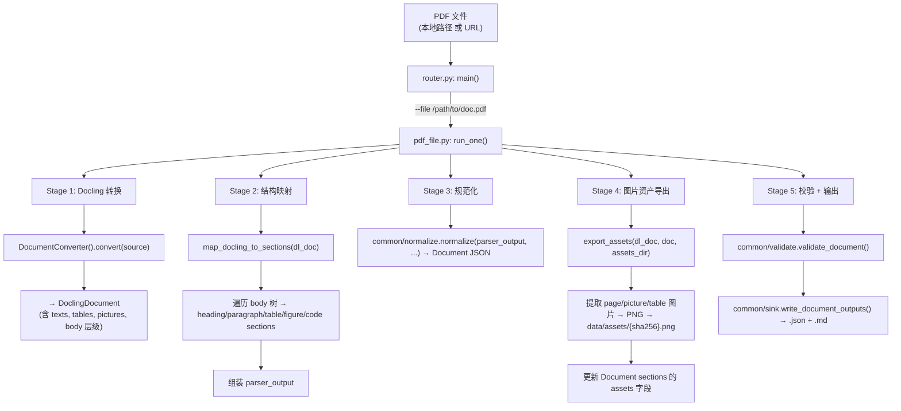

# raw_pdf_parse 技术实现方案

> **目标读者**：实现者（LLM / 开发者）  
> **定位**：本文档是可直接指导编码的详细技术规格，效仿 `raw_epub_parse/IMPLEMENTATION.md`  
> **PDF 引擎**：Docling（IBM Research，MIT License，59k stars）  
> **参考实现**：`knowledge-core/reference/docling_test.py`

## 文档信息

| 项目         | 内容                                  |
| ------------ | ------------------------------------- |
| **文档标题** | raw_pdf_parse 技术实现方案            |
| **文档版本** | v1.0                                  |
| **创建日期** | 2026-05-03                            |
| **更新日期** | 2026-05-03                            |
| **文档作者** | convexwf                              |
| **文档类型** | 技术设计                              |
| **参考资料** | reference/docling_test.py, docling docs, schemas/document.json |

## Table of Contents

- [1. 文件结构](#1-文件结构)
- [2. 依赖项](#2-依赖项)
- [3. 数据流全景](#3-数据流全景)
- [4. Docling 基础 API](#4-docling-基础-api)
- [5. 输入格式](#5-输入格式)
- [6. 模块规格：pdf_file.py](#6-模块规格pdf_filepy)
  - [6.1 convert_pdf](#61-convert_pdf)
  - [6.2 map_docling_to_sections](#62-map_docling_to_sections)
  - [6.3 export_assets](#63-export_assets)
  - [6.4 run_one](#64-run_one)
- [7. 模块规格：router.py](#7-模块规格routerpy)
- [8. 自包含公共模块：common/](#8-自包含公共模块common)
- [9. DoclingDocument → Document Schema 映射](#9-doclingdocument--document-schema-映射)
- [10. Makefile 集成](#10-makefile-集成)
- [11. 边界情况与错误处理](#11-边界情况与错误处理)

---

## 1. 文件结构

```
raw_pdf_parse/
  ├── IMPLEMENTATION.md      # 本文档
  ├── requirements.txt       # Python 依赖
  ├── common/                # vendored 公共模块（从 raw_epub_parse 复制）
  │   ├── __init__.py
  │   ├── paths.py           # REPO_ROOT 路径解析
  │   ├── normalize.py       # parser_output → Document schema
  │   ├── sink.py            # Document → Markdown + JSON 文件写入
  │   └── validate.py        # JSON Schema 校验
  └── sources/
        ├── __init__.py
        ├── router.py        # CLI 入口 + 分发器
        ├── pdf_file.py      # 核心：PDF → DoclingDocument → parser_output → Document
        └── supported_sources.txt
```

**说明**：`common/` 下的四个模块直接从 `raw_epub_parse/common/` 复制（`paths.py`、`normalize.py`、`sink.py`、`validate.py`），功能完全一致，无需修改。保持自包含原则。

---

## 2. 依赖项

### requirements.txt

```text
docling>=2.0
```

**极简依赖哲学**：Docling 自身携带了完整的 PDF 处理链（含 OCR 引擎、布局模型、表格识别等），安装时自动拉取所有必要依赖。不需要单独安装 `beautifulsoup4`、`lxml`（PDF 不是 HTML）。

`jsonschema` 由 `common/validate.py` 单独依赖，已在 `raw_epub_parse/requirements.txt` 中声明，此处不重复（但 pip install 时不冲突）。

### Docling 简介

Docling 是 IBM Research 开源的文档理解库（MIT License），核心能力：

| 能力 | 说明 |
|------|------|
| 多格式支持 | PDF, DOCX, PPTX, XLSX, HTML, Images, Markdown 等 |
| PDF 布局分析 | 版面检测、阅读顺序、表格结构、公式识别 |
| OCR | 内置 EasyOCR，支持扫描版 PDF |
| 统一文档模型 | `DoclingDocument`（pydantic 类型，含文本/表格/图片/层级） |
| 多格式导出 | Markdown, HTML, JSON, DocTags |
| 本地执行 | 无需网络（模型首次下载后离线可用） |

### 核心 API（仅需两个类）

```python
from docling.document_converter import DocumentConverter

# 最简单的用法（与 reference/docling_test.py 一致）
converter = DocumentConverter()
result = converter.convert("path/to/file.pdf")
print(result.document.export_to_markdown())
```

```python
# 带图片导出的用法
from docling.datamodel.base_models import InputFormat
from docling.datamodel.pipeline_options import PdfPipelineOptions
from docling.document_converter import DocumentConverter, PdfFormatOption
from docling_core.types.doc import ImageRefMode

pipeline_options = PdfPipelineOptions()
pipeline_options.images_scale = 2.0
pipeline_options.generate_page_images = True
pipeline_options.generate_picture_images = True

converter = DocumentConverter(
    format_options={
        InputFormat.PDF: PdfFormatOption(pipeline_options=pipeline_options)
    }
)
result = converter.convert(source)
result.document.save_as_markdown("out.md", image_mode=ImageRefMode.REFERENCED)
```

---

## 3. 数据流全景



**与 raw_epub_parse 的关键差异**：

| 维度 | raw_epub_parse | raw_pdf_parse |
|------|----------------|---------------|
| 解析引擎 | 自写 XHTML DOM 遍历 | Docling（不自己解析 PDF） |
| 元数据来源 | Calibre metadata.opf + EPUB OPF | DoclingDocument 元数据（title, authors — coming soon） |
| 图片来源 | Calibre 外部 cover.jpg + EPUB 内嵌 | Docling 渲染的 page/picture 图片 |
| 输入类型 | Calibre 目录 / .epub 文件 | .pdf 本地路径 / PDF URL |
| 代码量 | ~800 行 | ~300 行（Docling 承担核心复杂度） |

---

## 4. Docling 基础 API

### 4.1 DocumentConverter

```python
from docling.document_converter import DocumentConverter

converter = DocumentConverter()
result = converter.convert(source)

# result 结构
result.document           # DoclingDocument 实例
result.input.file         # 输入文件信息
```

`source` 支持：
- 本地文件路径：`"/path/to/doc.pdf"`
- URL：`"https://arxiv.org/pdf/2408.09869"`
- 二进制流：`DocumentStream(name="doc.pdf", stream=BytesIO(buf))`

### 4.2 DoclingDocument

`DoclingDocument` 是 pydantic 模型，核心字段：

| 字段 | 类型 | 说明 |
|------|------|------|
| `texts` | `list[TextItem]` | 所有文本项（段落、标题、公式等） |
| `tables` | `list[TableItem]` | 所有表格 |
| `pictures` | `list[PictureItem]` | 所有图片 |
| `body` | `NodeItem` | 文档主体树结构的根节点 |
| `pages` | `dict[int, Page]` | 页面对象（含 `page_no`, `image`） |
| `name` | `str` | 文档名 |
| `origin` | `Origin` | 来源信息（含 filename，mimetype） |

### 4.3 遍历文档内容

```python
from docling_core.types.doc import PictureItem, TableItem, TextItem

# iterate_items() 按阅读顺序遍历，返回 (item, level)
for element, level in result.document.iterate_items():
    if isinstance(element, TextItem):
        text = element.text
        label = element.label  # "paragraph", "heading_1", "heading_2", etc.
    elif isinstance(element, TableItem):
        # element.data.table_2d() → 二维表格数据
        pass
    elif isinstance(element, PictureItem):
        # element.get_image(doc) → PIL.Image
        pass
```

### 4.4 图片导出模式

```python
from docling_core.types.doc import ImageRefMode

# 嵌入模式：图片 base64 写入 Markdown
doc.save_as_markdown("out.md", image_mode=ImageRefMode.EMBEDDED)

# 引用模式：图片保存到文件，Markdown 中引用路径
doc.save_as_markdown("out.md", image_mode=ImageRefMode.REFERENCED)

# 仅文本模式
doc.export_to_markdown()  # 无图片
```

### 4.5 PdfPipelineOptions

```python
from docling.datamodel.pipeline_options import PdfPipelineOptions

opts = PdfPipelineOptions()
opts.images_scale = 2.0                # 渲染分辨率（1.0 ~ 72 DPI）
opts.generate_page_images = True       # 生成页面图片
opts.generate_picture_images = True    # 生成图片元素图片
opts.do_ocr = True                     # 启用 OCR（默认）
opts.do_table_structure = True         # 启用表格结构识别
```

---

## 5. 输入格式

### 5.1 本地 PDF 文件

```bash
make pdf-parse FILE="/path/to/paper.pdf"
```

### 5.2 PDF URL（arXiv 等）

```bash
make pdf-parse URL="https://arxiv.org/pdf/2408.09869"
```

### 5.3 二进制流（Go acquire 传入）

Phase 2 场景：从 `data/rawdocs/{id}.pdf` 读取字节，包装为 `DocumentStream` 传给 Docling。

---

## 6. 模块规格：pdf_file.py

### 6.1 convert_pdf

```python
def convert_pdf(source: str | Path) -> tuple[Any, dict[str, Any]]:
    """
    调用 Docling 转换 PDF，返回 DoclingDocument 和元数据。

    Args:
        source: 本地文件路径 或 PDF URL

    Returns:
        (DoclingDocument, metadata_dict)

    metadata_dict = {
        "title": 从 DoclingDocument 或文件名提取,
        "authors": [],
        "language": "",
        "published_at": None,
        "page_count": int,
    }
    """
```

**实现**：

```python
from pathlib import Path
from docling.document_converter import DocumentConverter
from docling.datamodel.base_models import InputFormat
from docling.datamodel.pipeline_options import PdfPipelineOptions
from docling.document_converter import PdfFormatOption

def convert_pdf(source: str | Path):
    source = str(source)

    pipeline_options = PdfPipelineOptions()
    pipeline_options.images_scale = 2.0
    pipeline_options.generate_page_images = True
    pipeline_options.generate_picture_images = True

    converter = DocumentConverter(
        format_options={
            InputFormat.PDF: PdfFormatOption(pipeline_options=pipeline_options)
        }
    )

    result = converter.convert(source)
    dl_doc = result.document

    # 提取元数据
    title = ""
    if hasattr(dl_doc, 'name') and dl_doc.name:
        title = dl_doc.name
    if not title:
        title = Path(source).stem if Path(source).exists() else source.rsplit("/", 1)[-1]

    page_count = len(dl_doc.pages) if hasattr(dl_doc, 'pages') and dl_doc.pages else 0

    metadata = {
        "title": title,
        "authors": [],
        "language": "",
        "published_at": None,
        "page_count": page_count,
    }

    return dl_doc, metadata
```

### 6.2 map_docling_to_sections

```python
def map_docling_to_sections(dl_doc: Any) -> list[dict[str, Any]]:
    """
    将 DoclingDocument 的内容项映射为 Document schema 的 sections 列表。

    映射规则：

    | Docling TextItem.label   | Document section type | 说明              |
    |--------------------------|-----------------------|-------------------|
    | "heading_1" ~ "heading_6"| heading (level 1~6)   | 章节标题          |
    | "paragraph" / default    | paragraph             | 段落              |
    | "list_item"              | list                  | 列表（合并相邻）  |
    | "code"                   | code                  | 代码块            |
    | "caption"                | paragraph             | 图/表标题（文本） |
    | "footnote"               | paragraph             | 脚注              |
    | "formula"                | paragraph             | 公式（文本形式）  |

    | Docling TableItem        | table (rows 数组)     | 表格              |
    | Docling PictureItem      | figure (assets)       | 图片              |

    Returns:
        list of section dicts with keys: section_id, type, level, content, items, rows, assets
    """
```

**实现要点**：

```python
from docling_core.types.doc import PictureItem, TableItem, TextItem

def map_docling_to_sections(dl_doc):
    sections = []
    sid = 0
    pending_list_items = []

    def next_id(prefix):
        nonlocal sid
        sid += 1
        return f"{prefix}-{sid}"

    def flush_list():
        nonlocal pending_list_items
        if pending_list_items:
            sections.append({
                "section_id": next_id("lst"),
                "type": "list",
                "content": "",
                "items": list(pending_list_items),
            })
            pending_list_items = []

    for element, _level in dl_doc.iterate_items():
        if isinstance(element, TextItem):
            label = element.label or "paragraph"
            text = (element.text or "").strip()

            if not text:
                continue

            if label.startswith("heading_"):
                flush_list()
                level_str = label.split("_")[-1]
                try:
                    level = int(level_str)
                except ValueError:
                    level = 2
                sections.append({
                    "section_id": next_id("h"),
                    "type": "heading",
                    "level": min(max(level, 1), 6),
                    "content": text,
                })

            elif label == "list_item":
                pending_list_items.append(text)

            elif label in ("code", "programlisting"):
                flush_list()
                sections.append({
                    "section_id": next_id("cd"),
                    "type": "code",
                    "content": text,
                })

            else:
                # paragraph, caption, footnote, formula, ...
                flush_list()
                sections.append({
                    "section_id": next_id("p"),
                    "type": "paragraph",
                    "content": text,
                })

        elif isinstance(element, TableItem):
            flush_list()
            try:
                table_data = element.data.table_2d()
                rows = [[(cell.text or "").strip() for cell in row] for row in table_data]
            except Exception:
                rows = []
            if rows:
                sections.append({
                    "section_id": next_id("tbl"),
                    "type": "table",
                    "content": "",
                    "rows": rows,
                })

        elif isinstance(element, PictureItem):
            flush_list()
            caption = (element.caption_text() or "").strip() or None
            sections.append({
                "section_id": next_id("fig"),
                "type": "figure",
                "content": "",
                "assets": [{"caption": caption, "original_src": f"__picture__{sid}"}],
            })

    flush_list()
    return sections
```

**关键说明**：

- `element.label` 来自 Docling 的内容分类，稳定可靠。直接映射到 heading level 和 section type。
- `element.data.table_2d()` 返回 `list[list[TableCell]]`，每个 `TableCell` 有 `.text` 属性。
- 列表项需要合并：Docling 将每个 `<li>` 作为单独的 `list_item` TextItem，我们收集相邻项合并为一个 list section。
- 图片的 `original_src` 使用占位符 `__picture__{sid}`，后续在 `export_assets` 阶段替换为真实 asset 路径。

### 6.3 export_assets

```python
def export_assets(dl_doc: Any, doc: dict[str, Any], assets_dir: Path, doc_filename: str) -> dict[str, Any]:
    """
    从 DoclingDocument 导出图片资产，更新 Document 的 assets 字段。

    处理两种图片：
    1. PictureItem — 内嵌图片（figure/diagram）
    2. TableItem — 表格渲染图（作为备用，Phase 1 以文本表格为主）

    流程：
    1. 遍历 Document sections，找 type=="figure" 的 section
    2. 从 DoclingDocument.pictures 中按索引匹配 PictureItem
    3. 调用 element.get_image(dl_doc) → PIL.Image → save PNG → SHA256 asset_id
    4. 更新 section 的 assets: [{asset_id, path, caption}]
    """
```

**实现**：

```python
import hashlib
import io

def export_assets(dl_doc, doc, assets_dir, doc_filename):
    doc = dict(doc)
    sections = list(doc.get("sections") or [])
    assets_dir.mkdir(parents=True, exist_ok=True)

    # 构建 picture 索引（遍历 dl_doc 收集所有 PictureItem）
    pictures = []
    for element, _ in dl_doc.iterate_items():
        if isinstance(element, PictureItem):
            pictures.append(element)

    pic_idx = 0
    for sec in sections:
        if sec.get("type") != "figure" or not sec.get("assets"):
            continue

        new_assets = []
        for a in sec["assets"]:
            orig = a.get("original_src", "")
            if not orig or not orig.startswith("__picture__"):
                new_assets.append({"asset_id": "", "path": "", "caption": a.get("caption")})
                continue

            if pic_idx >= len(pictures):
                new_assets.append({"asset_id": "", "path": "", "caption": a.get("caption")})
                pic_idx += 1
                continue

            picture = pictures[pic_idx]
            pic_idx += 1

            try:
                img = picture.get_image(dl_doc)
                if img is None:
                    raise ValueError("get_image returned None")
            except Exception:
                new_assets.append({"asset_id": "", "path": "", "caption": a.get("caption")})
                continue

            buf = io.BytesIO()
            img.save(buf, format="PNG")
            data = buf.getvalue()

            h = hashlib.sha256(data[:65536]).hexdigest()[:16]
            asset_id = f"{h}.png"
            (assets_dir / asset_id).write_bytes(data)

            new_assets.append({
                "asset_id": asset_id,
                "path": f"assets/{asset_id}",
                "caption": a.get("caption"),
            })

        sec["assets"] = new_assets

    doc["sections"] = sections
    return doc
```

**备选简化方案（Phase 1 推荐）**：

Docling 自身支持 `save_as_markdown(image_mode=ImageRefMode.REFERENCED)`，可以直接产出带本地图片引用的 Markdown。Phase 1 可以采用双轨策略：

- **主输出**：通过 `document_to_markdown(doc)` 生成（与 EPUB 一致，保证 schema 一致性）
- **辅助输出**：同时用 `dl_doc.save_as_markdown()` 保存一份 Docling 原生 Markdown 作为参考

图片资产导出采用上述 `export_assets` 方式，保证与 raw_epub_parse 一致的数据布局。

### 6.4 run_one

```python
def run_one(
    source: str,
    canonical_url: str,
    rawdocs_dir: Path,
    assets_dir: Path,
    docs_dir: Path,
    timeout: int,
    do_validate: bool,
    *,
    work_id: str = "",
    variant: str = "preprint",
) -> None:
    """
    处理单个 PDF 文件的完整流水线。

    Args:
        source: PDF 本地路径 或 URL
        canonical_url: 来源 URI
        rawdocs_dir: data/rawdocs/ 目录（Phase 1 不使用，保留接口兼容性）
        assets_dir: data/assets/ 目录
        docs_dir: data/docs/ 目录
        timeout: 保留参数（Docling 内部管理耗时）
        do_validate: 是否执行 JSON Schema 校验
        work_id: 逻辑作品 ID
        variant: 变体标识（默认 "preprint"）
    """
```

**完整实现**：

```python
import uuid
from pathlib import Path

from common.normalize import normalize
from common.paths import REPO_ROOT
from common.sink import write_document_outputs
from common.validate import validate_document

def run_one(source, canonical_url, rawdocs_dir, assets_dir, docs_dir,
            timeout, do_validate, *, work_id="", variant="preprint"):
    # 1. Docling 转换
    dl_doc, pdf_meta = convert_pdf(source)
    source_uri = canonical_url or f"file://{Path(source).resolve()}"

    # 2. 映射为 sections
    sections = map_docling_to_sections(dl_doc)

    # 3. 组装 parser_output
    parser_output = {
        "meta": {
            "title": pdf_meta["title"],
            "authors": pdf_meta["authors"],
            "language": pdf_meta["language"],
            "published_at": pdf_meta["published_at"],
            "tags": [],
            "parser_version": "raw_pdf_parse.pdf_file 0.1.0",
        },
        "sections": sections,
    }

    # 4. 规范化
    rawdoc_id = str(uuid.uuid4())

    doc = normalize(
        parser_output,
        rawdoc_id=rawdoc_id,
        storage_path=str(Path(source).resolve()),
        source_uri=source_uri,
        source_type="pdf",
    )

    # 5. 标签
    tags = list(doc["meta"].get("tags") or [])
    tags.append(f"pdf:variant:{variant}")
    if work_id:
        tags.append(f"pdf:work_id:{work_id}")
    doc["meta"]["tags"] = tags

    # 6. 图片资产处理
    doc = export_assets(dl_doc, doc, assets_dir, Path(source).stem)

    # 7. 校验
    if do_validate:
        validate_document(doc, REPO_ROOT)

    # 8. 输出
    doc_id = doc["doc_id"]
    json_path, md_path = write_document_outputs(
        doc, docs_dir, rawdocs_dir, rawdoc_id, write_done=False,
    )

    print(
        f"doc_id={doc_id} doc_json={json_path} doc_md={md_path}",
        flush=True,
    )
```

---

## 7. 模块规格：router.py

```python
#!/usr/bin/env python3
"""
Route PDF file paths (or URLs) to raw_pdf_parse source parsers.

Single local file:
    python sources/router.py --file /path/to/paper.pdf

Single PDF URL:
    python sources/router.py --url https://arxiv.org/pdf/2408.09869

Batch:
    python sources/router.py --urls-file path/to/batch.tsv

Run from repo root:
    make pdf-parse FILE="/path/to/paper.pdf"
    make pdf-parse URL="https://arxiv.org/pdf/2408.09869"
"""
from __future__ import annotations

import argparse
import importlib
import sys
import time
from collections.abc import Callable
from pathlib import Path

_SOURCES_DIR = Path(__file__).resolve().parents[0]
_PDF_PARSE_ROOT = _SOURCES_DIR.parent
if str(_PDF_PARSE_ROOT) not in sys.path:
    sys.path.insert(0, str(_PDF_PARSE_ROOT))

import pdf_file
from common.paths import REPO_ROOT

RunOne = Callable[..., None]

_SOURCES_FILE = Path(__file__).with_name("supported_sources.txt")
_REGISTRY: dict[str, RunOne] | None = None
_BATCH_DELAY_SEC = 0.0


def _load_registry() -> dict[str, RunOne]:
    global _REGISTRY
    if _REGISTRY is not None:
        return _REGISTRY

    _REGISTRY = {
        "*.pdf": pdf_file.run_one,
        "url": pdf_file.run_one,
    }

    if _SOURCES_FILE.is_file():
        for line in _SOURCES_FILE.read_text(encoding="utf-8").splitlines():
            line = line.strip()
            if not line or line.startswith("#") or "\t" not in line:
                continue
            pattern, mod = line.split("\t", 1)
            pattern = pattern.strip().lower()
            mod = mod.strip().removesuffix(".py")
            if not pattern or not mod:
                continue
            m = importlib.import_module(mod)
            _REGISTRY[pattern] = m.run_one

    return _REGISTRY


def resolve_run_one(input_path: str) -> RunOne | None:
    reg = _load_registry()
    if input_path.startswith("http://") or input_path.startswith("https://"):
        return reg.get("url")
    if input_path.lower().endswith(".pdf"):
        return reg.get("*.pdf")
    return None


def main() -> None:
    _load_registry()

    ap = argparse.ArgumentParser(
        description="Parse PDF files into Document schema (via Docling)",
    )
    ap.add_argument("--file", default="", help="Local PDF file path")
    ap.add_argument("--url", default="", help="PDF URL (arXiv etc.)")
    ap.add_argument("--canonical-url", default="", help="source_uri override")
    ap.add_argument("--work-id", default="", help="Logical work id")
    ap.add_argument("--variant", default="preprint", help="preprint|paper|report|...")
    ap.add_argument("--urls-file", default="", help="Batch: one path per line")
    ap.add_argument("--rawdocs", default=None, help="RawDocs dir")
    ap.add_argument("--assets", default=None, help="Assets dir")
    ap.add_argument("--docs", default=None, help="Docs dir")
    ap.add_argument("--timeout", type=int, default=300, help="Timeout seconds (default 5 min)")
    ap.add_argument("--no-validate", action="store_true", help="Skip schema validation")
    args = ap.parse_args()

    rawdocs_dir = Path(args.rawdocs or REPO_ROOT / "data" / "rawdocs")
    assets_dir = Path(args.assets or REPO_ROOT / "data" / "assets")
    docs_dir = Path(args.docs or REPO_ROOT / "data" / "docs")
    do_validate = not args.no_validate

    single = (args.file or args.url or "").strip()

    if args.urls_file and single:
        print("Use either --urls-file or --file/--url, not both", file=sys.stderr)
        sys.exit(2)

    jobs: list[tuple[str, str, str, str]] = []

    if args.urls_file:
        p = Path(args.urls_file)
        if not p.is_file():
            print(f"URLs file not found: {p}", file=sys.stderr)
            sys.exit(1)
        for line in p.read_text(encoding="utf-8").splitlines():
            line = line.strip()
            if not line or line.startswith("#"):
                continue
            parts = [x.strip() for x in line.split("\t")]
            if len(parts) >= 3:
                wid, var, epath = parts[0], parts[1], parts[2]
                canonical = parts[3] if len(parts) > 3 else f"file://{Path(epath).resolve()}"
            else:
                epath = parts[0]
                wid = ""
                var = "preprint"
                canonical = ""
            jobs.append((wid, var, epath, canonical))
        if not jobs:
            print(f"No valid jobs in file: {p}", file=sys.stderr)
            sys.exit(1)
    else:
        if not single:
            print(
                "Usage: python sources/router.py --file /path/to/paper.pdf\n"
                "   or: python sources/router.py --url https://arxiv.org/pdf/...",
                file=sys.stderr,
            )
            sys.exit(2)
        canonical = args.canonical_url.strip() or (
            single if single.startswith("http") else f"file://{Path(single).resolve()}"
        )
        work_id = args.work_id.strip()
        variant = args.variant.strip() or "preprint"
        jobs = [(work_id, variant, single, canonical)]

    failed = 0
    batch = len(jobs) > 1

    for i, (work_id, variant, source, canonical) in enumerate(jobs):
        if batch:
            print(f"--- {source}", file=sys.stderr)
        if i > 0:
            time.sleep(_BATCH_DELAY_SEC)

        p = Path(source)
        is_url = source.startswith("http://") or source.startswith("https://")
        if not is_url and not p.is_file():
            print(f"MISSING: {source}", file=sys.stderr)
            failed += 1
            continue

        runner = resolve_run_one(source)
        if runner is None:
            print(f"UNSUPPORTED: {source}", file=sys.stderr)
            failed += 1
            continue

        if not work_id:
            work_id = source if is_url else p.stem

        try:
            runner(
                source,
                canonical,
                rawdocs_dir,
                assets_dir,
                docs_dir,
                args.timeout,
                do_validate,
                work_id=work_id,
                variant=variant,
            )
        except Exception as e:
            import traceback
            traceback.print_exc(file=sys.stderr)
            print(f"error: {e}", file=sys.stderr)
            failed += 1

    if failed:
        sys.exit(1)


if __name__ == "__main__":
    main()
```

### supported_sources.txt

```text
# raw_pdf_parse source registry
# pattern\tmodule
*.pdf	pdf_file
```

---

## 8. 自包含公共模块：common/

直接从 `raw_epub_parse/common/` 复制以下四个文件，无需修改：

| 文件 | 来源 | 功能 |
|------|------|------|
| `paths.py` | `raw_epub_parse/common/paths.py` | REPO_ROOT 路径解析（`parents[2]`） |
| `normalize.py` | `raw_epub_parse/common/normalize.py` | parser_output → Document schema |
| `sink.py` | `raw_epub_parse/common/sink.py` | Document → Markdown + JSON 写入 |
| `validate.py` | `raw_epub_parse/common/validate.py` | JSON Schema 校验 |

**路径验证**：`common/paths.py` 的 `parents[2]` 从 `raw_pdf_parse/common/` 向上两级到达 `knowledge-core/`，与 EPUB 模块完全一致。

**注意**：`make normalize` 函数中 source_type 需要保持可配置（默认 `"epub"`），调用时传入 `source_type="pdf"`。如果源文件硬编码了 `"epub"` 默认值，需修改为接受参数。当前 `normalize.py` 中 `source_type: str = "epub"` 是默认值，调用时传入 `source_type="pdf"` 即可覆盖，无需修改源文件。

---

## 9. DoclingDocument → Document Schema 映射

### 完整映射表

| Docling 类型 | label 属性 | Document section 类型 | 字段映射 |
|-------------|------------|----------------------|----------|
| `TextItem` | `heading_1` | `heading` (level=1) | `content` ← `element.text` |
| `TextItem` | `heading_2` | `heading` (level=2) | `content` ← `element.text` |
| `TextItem` | `heading_3~6` | `heading` (level=3~6) | `content` ← `element.text` |
| `TextItem` | `paragraph` | `paragraph` | `content` ← `element.text` |
| `TextItem` | `caption` | `paragraph` | `content` ← `element.text` |
| `TextItem` | `footnote` | `paragraph` | `content` ← `element.text` |
| `TextItem` | `formula` | `paragraph` | `content` ← `element.text` |
| `TextItem` | `list_item` | `list`（合并相邻） | `items[]` ← 收集相邻文本 |
| `TextItem` | `code` | `code` | `content` ← `element.text` |
| `TextItem` | `programlisting` | `code` | `content` ← `element.text` |
| `TableItem` | — | `table` | `rows` ← `element.data.table_2d()` |
| `PictureItem` | — | `figure` | `assets` ← 占位符，后续替换 |

### 列表合并算法

```python
pending_list_items = []

def flush_list():
    # 当遇到非 list_item 时，将收集的项合并为一个 list section
    if pending_list_items:
        sections.append({"type": "list", "items": pending_list_items})
        pending_list_items.clear()

# 遍历中
if label == "list_item":
    pending_list_items.append(text)
else:
    flush_list()
    # ... 处理其他类型 ...

# 遍历结束后
flush_list()
```

### 表格数据提取

```python
if isinstance(element, TableItem):
    table_data = element.data.table_2d()
    # table_data: list[list[TableCell]]
    rows = []
    for row in table_data:
        row_texts = [(cell.text or "").strip() for cell in row]
        rows.append(row_texts)
    # 注意：可能包含空行（全空 cell），需过滤
    rows = [r for r in rows if any(c for c in r)]
```

### 图片资产映射

图片使用两阶段处理：

1. **映射阶段**：创建 figure section，`original_src` 设为占位符 `__picture__{index}`，`caption` 取自 `element.caption_text()`
2. **导出阶段**：遍历 sections 中的 figure，按索引匹配 `dl_doc.pictures`，调用 `element.get_image(dl_doc)` 获取 PIL.Image，保存为 PNG，计算 SHA256

---

## 10. Makefile 集成

```makefile
# PDF parse: PDF -> Docling -> Document (see raw_pdf_parse/IMPLEMENTATION.md)
PDF_PARSE_DIR := $(REPO_ROOT)/raw_pdf_parse

pdf-parse-deps:
	@cd "$(PDF_PARSE_DIR)" && pip install -q -r requirements.txt

# 本地文件: make pdf-parse FILE="/path/to/paper.pdf"
# 远程 URL: make pdf-parse URL="https://arxiv.org/pdf/2408.09869"
pdf-parse: pdf-parse-deps
	@if [ -n "$(FILE)" ]; then \
		cd "$(PDF_PARSE_DIR)" && python sources/router.py \
			--file "$(abspath $(FILE))" \
			$(if $(WORK_ID),--work-id "$(WORK_ID)") \
			$(if $(VARIANT),--variant "$(VARIANT)"); \
	elif [ -n "$(URL)" ]; then \
		cd "$(PDF_PARSE_DIR)" && python sources/router.py \
			--url "$(URL)" \
			$(if $(WORK_ID),--work-id "$(WORK_ID)") \
			$(if $(CANONICAL),--canonical-url "$(CANONICAL)"); \
	else \
		echo "Usage: make pdf-parse FILE='path/to/paper.pdf' or make pdf-parse URL='https://arxiv.org/pdf/...'"; exit 1; fi

# 批量模式
pdf-parse-batch: pdf-parse-deps
	@test -n "$(FILE)" || (echo "Usage: make pdf-parse-batch FILE=path/to/batch.tsv"; exit 1)
	@cd "$(PDF_PARSE_DIR)" && python sources/router.py --urls-file "$(abspath $(FILE))"

# 快速测试（arXiv 示例 PDF）
pdf-parse-test: pdf-parse-deps
	@cd "$(PDF_PARSE_DIR)" && python sources/router.py \
		--url "https://arxiv.org/pdf/2408.09869" \
		--work-id "arxiv:2408.09869" \
		--variant "preprint"
```

对应的 Makefile `.PHONY` 需追加：`pdf-parse-deps pdf-parse pdf-parse-batch pdf-parse-test`

---

## 11. 边界情况与错误处理

| 场景 | 处理策略 | 错误级别 |
|------|----------|----------|
| PDF 文件不存在 | `FileNotFoundError`，退出码 1 | ERROR |
| PDF 远程 URL 不可达 | Docling 内部抛出异常，捕获并退出 | ERROR |
| PDF 损坏/无法解析 | Docling 抛出异常，捕获并退出 | ERROR |
| Docling 模型未下载 | 首次运行时自动下载（~2GB），耗时 2-5 分钟 | INFO |
| PDF 为扫描版（纯图片） | Docling 自动 OCR（EasyOCR），处理时间较长 | — |
| PDF 无文本内容（仅有图片） | sections 只有 figure，paragraph 为空 | — |
| PDF 超大（>100 页） | 使用 `max_num_pages` 限制（默认不限制） | — |
| 图片导出失败（get_image 返回 None） | 跳过该 figure，asset_id/path 留空 | WARN |
| 表格识别失败 | rows 为空数组，table section 不生成 | — |
| 公式未识别 | 以文本形式输出（`element.text`） | — |
| Docling 元数据缺失（title 为空） | 从文件名提取（Phase 1），未来 Docling 内置 | INFO |
| 内存不足（大 PDF + 高分辨率图片） | 降低 `images_scale` 或 `max_num_pages` | — |

### 资源消耗预期

| 场景 | 首次运行（含模型下载） | 后续运行 | 内存 |
|------|----------------------|----------|------|
| 10 页 arXiv 论文 | ~3 min | 10-30 sec | ~2 GB |
| 50 页技术报告 | ~3 min | 30-90 sec | ~3 GB |
| 200 页书籍 | ~3 min | 2-5 min | ~4 GB |

模型缓存路径：`$HOME/.cache/docling/models/`（~2 GB，仅需下载一次）

---

## 附录 A：与 raw_epub_parse 对比

| 维度 | raw_epub_parse | raw_pdf_parse |
|------|----------------|---------------|
| 解析引擎 | 自写（EPUB/ZIP → OPF → XHTML DOM） | Docling（一站式完成） |
| 核心代码量 | ~800 行 | ~300 行 |
| 输入类型 | Calibre 目录 / .epub | .pdf 本地 / URL |
| 元数据来源 | Calibre metadata.opf（丰富） | 文件名（Phase 1）/ Docling 即将内置 |
| 图片处理 | ZIP 提取 + 外部 cover.jpg | Docling 渲染 → PNG → SHA256 |
| 表格处理 | HTML table → rows 数组 | Docling TableItem.data.table_2d() |
| 公式处理 | 不支持 | Docling formula → 文本形式 |
| OCR 支持 | 无（EPUB 是文本） | 有（Docling 内置 EasyOCR） |
| 模型依赖 | 无 | ~2 GB（首次下载） |
| 离线可用 | 是 | 是（模型预下载后） |
| source_type | `"epub"` | `"pdf"` |

## 附录 B：实现清单

| # | 文件 | 说明 | 行数估 |
|---|------|------|--------|
| 1 | `raw_pdf_parse/requirements.txt` | docling>=2.0 | 1 |
| 2 | `raw_pdf_parse/common/__init__.py` | 空文件 | 0 |
| 3 | `raw_pdf_parse/common/paths.py` | 从 raw_epub_parse 复制 | 7 |
| 4 | `raw_pdf_parse/common/normalize.py` | 从 raw_epub_parse 复制 | 69 |
| 5 | `raw_pdf_parse/common/sink.py` | 从 raw_epub_parse 复制 | 148 |
| 6 | `raw_pdf_parse/common/validate.py` | 从 raw_epub_parse 复制 | 15 |
| 7 | `raw_pdf_parse/sources/__init__.py` | 空文件 | 0 |
| 8 | `raw_pdf_parse/sources/supported_sources.txt` | 注册表 | 3 |
| 9 | `raw_pdf_parse/sources/pdf_file.py` | 核心：convert → map → export | ~250 |
| 10 | `raw_pdf_parse/sources/router.py` | CLI：--file / --url / --urls-file | ~150 |
| 11 | `Makefile`（patch） | pdf-parse / pdf-parse-batch / pdf-parse-test | ~25 |

## 附录 C：关键设计决策

1. **Docling 承担核心复杂度**：不自己解析 PDF 文本、布局、表格、OCR。Docling 是 59k stars 的成熟项目，比自己写 PDF 解析可靠得多。

2. **双轨 Markdown 输出**：
   - 主输出：`document_to_markdown(doc)` 通过 Document schema → Markdown（与 EPUB 一致）
   - 参考输出：`dl_doc.save_as_markdown()` 保留 Docling 原生 Markdown（更好的图片引用）

3. **图片资产两阶段处理**：映射阶段创建带占位符的 figure section，导出阶段从 DoclingDocument 提取实际图片。避免在映射阶段持有大量 PIL.Image 对象。

4. **无 RawDoc 写入**：Phase 1 不存储原始 PDF 字节（与 EPUB 模块一致，简化流程）。PDF 原始文件已在文件系统中，通过 `storage_path` 引用。

5. **首次运行需下载模型**：Docling 的 `DocumentConverter` 首次调用时自动下载布局模型、OCR 模型等（~2 GB），后续调用无需下载。若需完全离线，可用 `docling-tools models download` 预下载。

6. **common/ 代码复制而非引用**：与 `raw_epub_parse` 保持一致的自包含原则。未来考虑提取为共享包。
